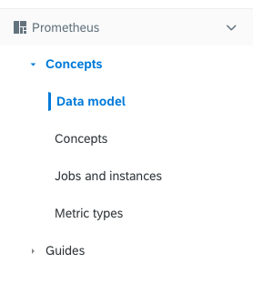

Headless CMS allows you to extend documentation topics in the Console UI using ClusterDocsTopic custom resources.

When you prepare ClusterDocsTopics, make sure that:
- ClusterDocsTopics have a proper [custom resource definition](#custom-resource-clusterdocstopic).
- Documents start with metadata, including obligatory `Title` for the document name and optional `Type` for any additional document grouping.
- Documents are written in Markdown and follow a simple Markdown syntax. Any customizations can result in incorrect images or links rendering. To avoid such issues, use our [content guidelines](https://github.com/kyma-project/community/tree/master/guidelines/content-guidelines).

This tutorial shows how you can customize the `docs-ui` view that is available in the Console UI under the  icon on the top navigation panel. The purpose of this tutorial is to create a new **Prometheus** documentation section that contains **Concepts** and **Guides** topic groups and a set of Markdown subdocuments. The document sources used in the ClusterDocsTopics point to the official Prometheus documentation which specific topics filtered out.  

>**NOTE:** When you apply multiple ClusterDocsTopics, sort them using the **order** label. Otherwise, the Console UI displays the topics in the order in which you applied them.

## Prerequisites

- [kubectl](https://kubernetes.io/docs/tasks/tools/install-kubectl/)

## Steps

1. Install Kyma.

2. In the terminal, apply these ClusterDocsTopic custom resources:

```yaml
cat <<EOF | kubectl apply -f -
apiVersion: cms.kyma-project.io/v1alpha1
kind: ClusterDocsTopic
metadata:
  labels:
    cms.kyma-project.io/view-context: docs-ui
    cms.kyma-project.io/group-name: prometheus
    cms.kyma-project.io/order: "1"
  name: prometheus-concepts
spec:
  displayName: "Concepts"
  description: "Some docs about Prometheus concepts"
  sources:
    - type: markdown
      name: docs
      mode: package
      url: https://github.com/prometheus/docs/archive/master.zip
      filter: content/docs/concepts
---
apiVersion: cms.kyma-project.io/v1alpha1
kind: ClusterDocsTopic
metadata:
  labels:
    cms.kyma-project.io/view-context: docs-ui
    cms.kyma-project.io/group-name: prometheus
    cms.kyma-project.io/order: "2"
  name: prometheus-guides
spec:
  displayName: "Guides"
  description: "Some docs about Prometheus guides"
  sources:
    - type: markdown
      name: docs
      mode: package
      url: https://github.com/prometheus/docs/archive/master.zip
      filter: content/docs/guides
EOF
```

3. Check their status:

```
kubectl get clusterdocstopics
```

The custom resources should be in the `Ready` phase:

```
NAME                                   PHASE   AGE
prometheus-concepts                    Ready   59s
prometheus-guides                      Ready   59s
```

If a given custom resource is in the `Ready` phase and you want to get details of the created ClusterAssets, such as document names and the location of Minio buckets, run this command:

```
kubectl get clusterasset -o yaml -l cms.kyma-project.io/docs-topic=prometheus-concepts
```

The result is as follows:

```
apiVersion: v1
items:
- apiVersion: assetstore.kyma-project.io/v1alpha2
  kind: ClusterAsset
  metadata:
    annotations:
      cms.kyma-project.io/asset-short-name: docs
    creationTimestamp: "2019-05-15T13:27:11Z"
    finalizers:
    - deleteclusterasset.finalizers.assetstore.kyma-project.io
    generation: 1
    labels:
      cms.kyma-project.io/docs-topic: prometheus-concepts
      cms.kyma-project.io/type: markdown
    name: prometheus-concepts-docs-markdown-1b7mu6bmkmse4
    ownerReferences:
    - apiVersion: cms.kyma-project.io/v1alpha1
      blockOwnerDeletion: true
      controller: true
      kind: ClusterDocsTopic
      name: prometheus-concepts
      uid: 253c311b-7715-11e9-b241-1e5325edb3d6
    resourceVersion: "6785"
    selfLink: /apis/assetstore.kyma-project.io/v1alpha2/clusterassets/prometheus-concepts-docs-markdown-1b7mu6bmkmse4
    uid: 253eee7d-7715-11e9-b241-1e5325edb3d6
  spec:
    bucketRef:
      name: cms-public-1b7mtf1de5ost
    source:
      filter: content/docs/concepts
      metadataWebhookService:
      - endpoint: /v1/extract
        filter: \.md$
        name: assetstore-asset-metadata-service
        namespace: kyma-system
      mode: package
      url: https://github.com/prometheus/docs/archive/master.zip
  status:
    assetRef:
      baseUrl: https://minio.kyma.local/cms-public-1b7mtf1de5ost-1b7mtf1h187r7/prometheus-concepts-docs-markdown-1b7mu6bmkmse4
      files:
      - metadata:
          sort_rank: 1
          title: Data model
        name: docs-master/content/docs/concepts/data_model.md
      - metadata:
          nav_icon: flask
          sort_rank: 2
          title: Concepts
        name: docs-master/content/docs/concepts/index.md
      - metadata:
          sort_rank: 3
          title: Jobs and instances
        name: docs-master/content/docs/concepts/jobs_instances.md
      - metadata:
          sort_rank: 2
          title: Metric types
        name: docs-master/content/docs/concepts/metric_types.md
    lastHeartbeatTime: "2019-05-15T13:27:24Z"
    message: Asset content has been uploaded
    observedGeneration: 1
    phase: Ready
    reason: Uploaded
kind: List
metadata:
  resourceVersion: ""
  selfLink: ""
```

4. Open the Console UI and navigate to the `docs-ui` view. The new **Prometheus** section with **Concepts** and **Guides** topic groups and alphabetically ordered Markdown documents appear at the bottom of the documentation panel:



## Troubleshooting

If you apply the ClusterDocsTopic custom resource but its status stays `Pending` or shows `Failed`, check the status details.

This command checks the status details for the `prometheus-concepts` ClusterDocsTopic:

```
kubectl get clusterasset -o yaml -l cms.kyma-project.io/docs-topic=prometheus-concepts
```

See the status details sample:

```
status:
  phase: Failed
  reason: ValidationFailed
  message: "The file is not valid against the provided json schema"
```

You can also analyze logs of the Asset Store Controller Manager:

```
kubectl -n kyma-system logs -l 'app=asset-store-controller-manager'
```
