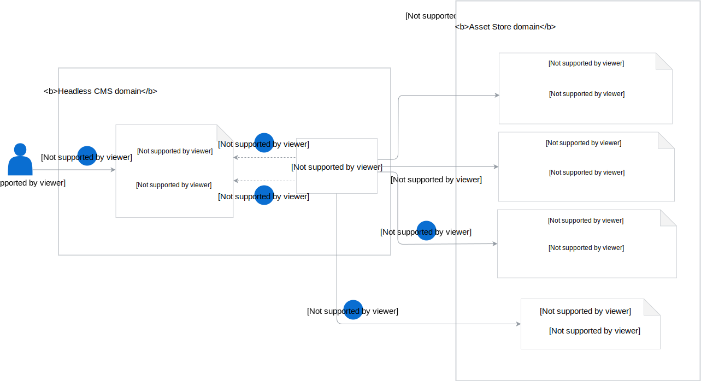

## Resources

The Headless CMS in Kyma consists of these components:

- **DocsTopic custom resource** (CR) is a resource used to orchestrate the creation of multiple Asset CRs for a specific documentation topic in a given Namespace. It has a cluster-wide counterpart called **ClusterDocsTopic CR**.

- **DocsTopic Controller** creates the Asset custom resources (CRs) based on the DocsTopic CR definition. If the DocsTopic CR defines two sources of the documentation topics, such as `asyncapi` and `markdown`, the DocsTopic Controller creates two Asset CRs.
The DocsTopic Controller also monitors the status of the Asset CR and updates the status of the DocsTopic CR accordingly.

## Headless CMS flow

See the diagram for an overview of the basic Headless CMS workflow and the role of its components in this process.

>**NOTE:** This flow also applies to the ClusterDocsTopic CR.

1. The Kyma user creates a DocsTopic CR in a given Namespace.
2. The DocsTopic Controller reads the DocsTopic CR definition.
3. The DocsTopic Controller creates Asset CRs in the number corresponding to the number of sources specified in the DocsTopic CR. It adds **cms.kyma-project.io/type** and **cms.kyma-project.io/docs-topic** labels to every Asset CR definition.
4. The DocsTopic Controller verifies if the Asset CRs are in the `Ready` phase and updates the status of the DocsTopic CR accordingly.
5. The DocsTopic Controller also checks if the [Bucket CR](asset-store/#details-bucket-custom-resource-lifecycle) already exists in this Namespace. If it does not exist yet, the DocsTopic Controller creates it with the name `cms-public-{suffix}`, where `{suffix}` is a randomly generated string. It also adds information of its name under the **bucketRef** field to every Asset CR definition.
