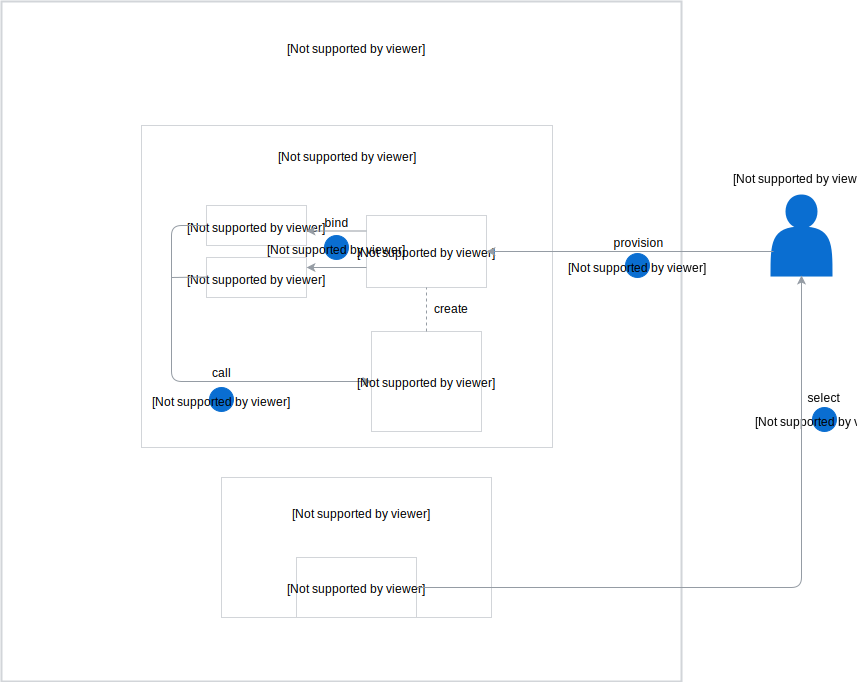

The Helm Broker is installed alongside other Kyma components and it automatically registers itself in the Service Catalog as a ClusterServiceBroker. The installation provides the default [helm-repos-urls](https://github.com/kyma-project/kyma/blob/master/resources/helm-broker/templates/default-addons-cfg.yaml) ClusterAddonsConfiguration (CAC) custom resource (CR). It contains URLs from which Helm Broker fetches addons. You can also add your own addons with URLs that point to [your addons repository](#details-create-addons-repository).

If you want the Helm Broker to act as a Namespace-scoped ServiceBroker, create the [AddonsConfiguration](#custom-resource-addonsconfiguration) (AC) CR. In such a case, the Helm Broker creates a service and registers itself in the Service Catalog as a ServiceBroker inside the Namespace in which the CR is created.

The Helm Broker workflow starts with the registration process, during which the Helm Broker fetches addons from URLs provided in the ClusterAddonsConfiguration or AddonsConfiguration CRs and registers them as Service Classes in the Service Catalog.

>**NOTE:** The Helm Broker is the sole component that manages the `helm-broker` Service Broker and Cluster Service Broker. The user should not create or delete this resource.

## Cluster-wide addons flow

1. The Helm Broker watches for ClusterAddonsConfiguration CRs in a given cluster.
2. The user creates a ClusterAddonsConfiguration CR.
3. The Helm Broker fetches and parses the data of all addon repositories defined in the ClusterAddonsConfiguration CR.
4. The Helm Broker creates a ClusterServiceBroker. There is always only one ClusterServiceBroker, even if there are multiple ClusterAddonsConfiguration CRs.
5. The Service Catalog fetches services that the ClusterServiceBroker exposes.
6. The Service Catalog creates a ClusterServiceClass for each service received from the ClusterServiceBroker.

## Namespace-scoped addons flow

1. The Helm Broker watches for AddonsConfiguration CRs in all Namespaces.
2. The user creates an AddonsConfiguration CR in a given Namespace.
3. The Helm Broker fetches and parses the data of all addon repositories defined in the AddonsConfiguration CR.
4. The Helm Broker creates a Service Broker (SB) inside the Namespace in which the AddonsConfiguration CR is created. There is always a single ServiceBroker per Namespace, even if there are more AddonsConfigurations CRs.
5. The Service Catalog fetches the services that the Service Broker exposes.
6. The Service Catalog creates a ServiceClass for each service received from the Service Broker.

## Provisioning and binding

After you register your addons in the Service Catalog, you can provision and bind Service Classes that your addons provide.

1. Select a given addon Service Class from the Service Catalog.
2. Provision this Service Class by creating its ServiceInstance in a given Namespace.
3. Bind your ServiceInstance to a service or a lambda function.
4. The service or lambda calls a given addon.

