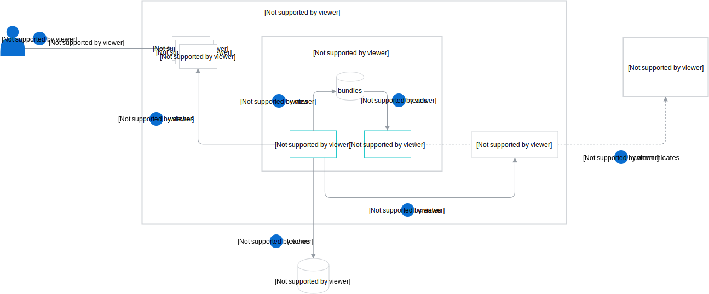

The diagram and steps describe the Helm Broker workflow in details, including the logic of its inner components, namely the Controller and Broker.

1. The Controller watches ClusterAddonsConfiguration (CAC) and AddonsConfiguration (AC) custom resources.
2. The user creates, updates, or deletes CAC or AC custom resources.
3. The Controller fetches and parses the data of all addon repositories defined in these custom resources.
4. The Controller saves (?) addon in the internal addons storage.
5. The Controller creates ClusterServiceBroker or ServiceBroker, depending on whether the

  2. Linting fetched bundles
  3. Checking for ID duplication under **repositories** field
  4. Checking for ID conflicts with already registered addons.
  5. Persist

  >**NOTE:** There is no fast return in case of error. All addons are fetched and processed. Thanks to the **status** entry, the user can read information about all detected problems with a given custom resource.

### Update/Relist CR

This section describes the situation when:
 - user updates already created addons configuration
 - relist action occurred (triggered by the resync interval)

Steps:
   1. If `status.observedGeneration == addon.generation` and `status == success` then do not process

      else: (execute similar logic as for **Add CRD**)

      1. If the configuration was marked as success then remove if from storage.
      2. Clear status and insert to queue - during the next processing of this object, the controller will treat it as newly added and logic from section **Add CR** will be executed.

Implications: when CRD is updated then it's treated as newly added.

### Delete CR

We need to execute clean-up logic, so all CRs need to have the `addons.kyma-project.io` finalizer.  

1. If the configuration was marked as success then remove it from storage.
2. If the ClusterAddonsConfiguration was removed and had `status == success`  then increment the `reprocessRequest` field of all failed ClusterAddonsConfiguration.
   If AddonsConfiguration was removed and had `status == success` then increment the `reprocessRequest` field of all failed AddonsConfiguration from the same namespace.

### Manual reprocessing

If Configuration was processed successfully then is not updated automatically. In such a case, user can always increment **reprocessRequest** to explicitly request reprocessing of already registered and processed Configuration, e.g. for re-fetching addons from a remote server.
