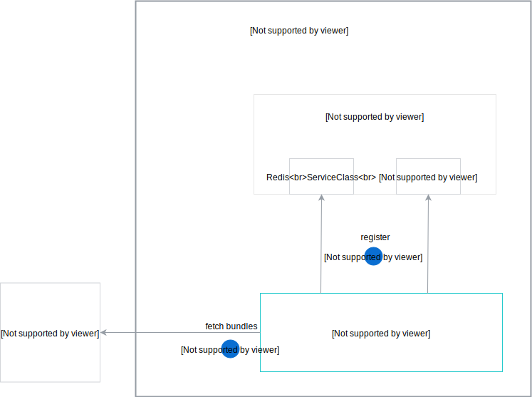
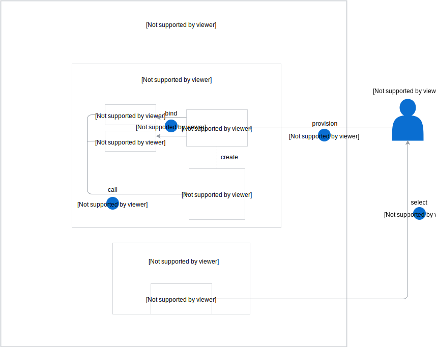

The Helm Broker workflow starts with the registration process, during which the Helm Broker fetches bundles from the Kyma [`bundles`](https://github.com/kyma-project/bundles) repository, or from a remote HTTPS server.

### Registration process

The registration process consists of the following steps:
1. The Helm Broker fetches bundles.
2. The Helm Broker registers bundles as Service Classes in the Service Catalog.

### Bundles provisioning and binding

After the registration, you can provision and bind your bundles. Follow these steps:

1. Select a given bundle Service Class from the Service Catalog.
2. Provision this Service Class by creating its ServiceInstance in a given Namespace.
3. Bind your ServiceInstance to a service or lambda.
4. The service or lambda calls a given bundle.

