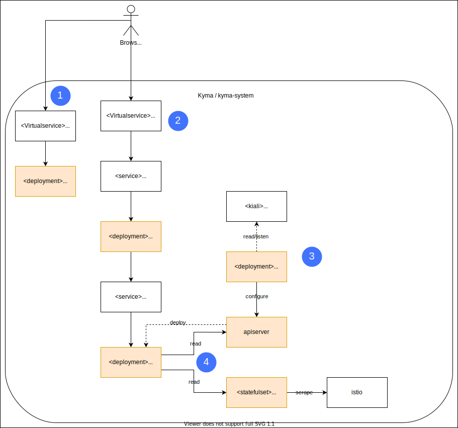

The following diagram provides an overview of the Kiali architecture in Kyma:

1. Kiali is integrated into Kyma's authentication component `dex`, which grants access to the Kiali Dashboards and graphs to authorised users.
2. Authenticated users can access the full Kiali UI and feature set from their browser by calling the Kiali service.
3. The Kiali operator deploys the kiali backend based on the provided configuration.
4. Kiali gathers information from service mesh by analyzing metrics from Prometheus and provide all its features (validation, graphs, config checks, etc...).