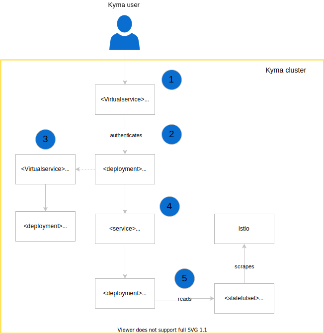

The following diagram provides an overview of the Kiali architecture in Kyma:

1. Kiali is integrated into Kyma's authentication component `dex`, which grants access to the Kiali Dashboards and graphs to authorised users.
2. Authenticated users can access the full Kiali UI adn feature set from their browser by calling the Kiali service.
3. The Kiali operator maintains the backend and sets up the API server for Kiali to be able to gather information about the service mesh.
4. Kiali gathers information from both Istio and Prometheus to provide all its features (validation, graphs, config checks, etc...).