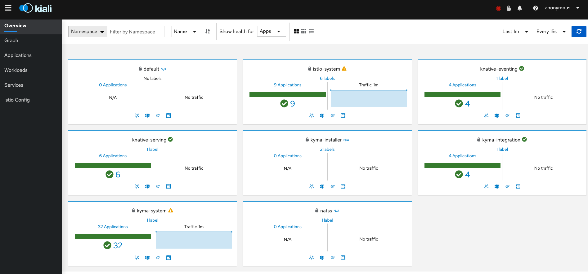

You can easily access Kiali from the [Kyma Console](/components/console/#overview-overview). To do so, click the **Service Mesh**  tab in the menu on the left.
Once you are authenticated, the main Kiali dashboard will show a summary of the Service Mesh status and the left side menu will offer you features such as graphs or configuration validation:

Use the graphs to review the topology of the Service Mesh:

