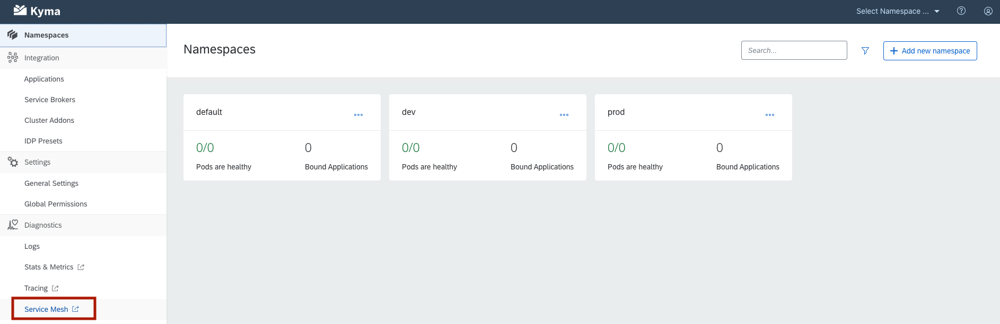

Kiali can be easily accessed from the left menu on the [Kyma Console](/components/console/#overview-overview) by clicking on the `Service Mesh` item:

Once authenticated, the main Kiali dashboard will show a summary of the service mesh status and the left side menu offers different features such as graphs or configuration validation:

Graphs are very useful to review the topology of the service mesh:
