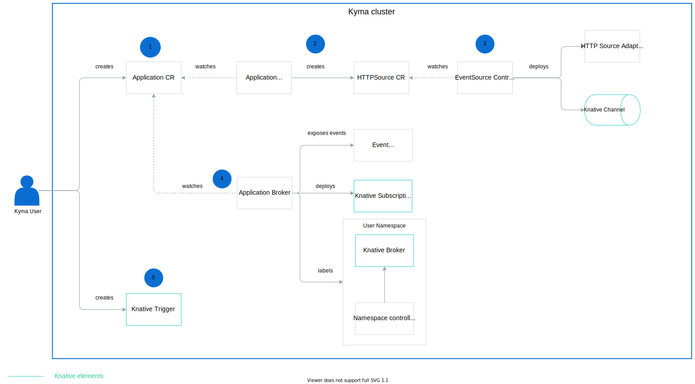

The architecture of Knative Eventing Mesh relies heavily on the functionality provided by the Knative Eventing components. To ensure a stable event flow between the sender and the subscriber, the Eventing Mesh wires Knative and Kyma components together.

## Component dependencies

This diagram shows how the Eventing Mesh components work together.

1. The user creates an [Application CR](https://kyma-project.io/docs/components/application-connector/#custom-resource-application) and binds it to a Namespace. 

2. The Application Operator watches the creation of the Application CR and creates an [HTTPSource CR](#custom-resource-http-source) which defines the source sending the events.

3. The Event Source Controller watches the creation of the HTTPSource CR and deploys these resources:

    * [HTTP Source Adapter](https://github.com/kyma-project/kyma/tree/master/components/event-sources/adapter/http) which is an HTTP server deployed inside the `kyma-integration` Namespace. This adapter acts as a gateway to the Channel, and is responsible for exposing an endpoint to which the Application sends the events. 

    * [Channel](https://knative.dev/docs/eventing/channels/) which defines the way messages are dispatched in the Namespace. Its underlying implementation is responsible for forwarding events to the Broker or additional Channels. Kyma uses NATS Streaming as its default Channel, but you can change it to InMemoryChannel, Kafka, or Google PubSub. For details on configuring the default Channel, see [this](/components/event-bus/#details-configure-default-knative-channel) document. 

4. The Application Broker watches the creation of the Application CR and performs the following actions:

    * Exposes the Events API of an external system as a ServiceClass. Once the user provisions this ServiceClass in the Namespace, the Application Broker makes events available to use.

    * Deploys Knative Subscription and defines the Broker as the subscriber for the Channel to allow communication between them.

    * Adds the `knative-eventing-injection` label to the user's Namespace. As a result, the Namespace controller creates the [Broker](https://knative.dev/docs/eventing/broker-trigger/) which acts as an entry point for the events. 

5. The user creates the [Trigger](https://knative.dev/docs/eventing/broker-trigger/) which references the Broker and defines the subscriber along with the conditions for filtering events. This way, certain subscribers receive only the events they are interested in. For details on the Trigger specification, see the **Trigger Filtering** section of [this](https://knative.dev/docs/eventing/broker-trigger/) document.

## Event flow 

This diagram explains the event flow in Kyma, from the moment the Application sends an event, to the point when the event triggers the function.

1. The Application sends events to the HTTP Source Adapter which forwards them to a resource such as the Broker.
   
    >**NOTE:** The HTTP Source Adapter accepts only CloudEvents in version 1.0. 

2. The Subscription defines the Broker as the subscriber. This way, the Channel can communicate with the Broker to send events.

3. The Channel listens for incoming events. When it receives an event, the underlying messaging layer dispatches it to the Broker.

4. The Broker sends the event to the Trigger which is configured to receive events of this type. 

5. The Trigger checks if the attributes of the incoming event match its specification. If they do, the Trigger sends the event to a subscriber, such as a lambda.