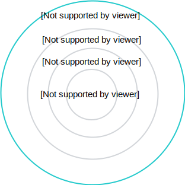

Integration with Knative is a step towards Kyma modularization and the "slimming" approach which aims to extract some out-of-the-box components and provide you with a more flexible choice of tools to use in Kyma.

Both Kyma and Knative are Kubernetes and Istio-based systems that offer development and eventing platforms. The main difference, however, is their focus. While Knative concentrates more on providing the building blocks for running serverless workloads, Kyma focuses on integrating those blocks with external services and applications.

The diagram shows dependencies between the components:

Kyma and Knative cooperation focuses on replacing Kyma eventing with Knative eventing, and Kyma Serverless with Knative serving.
