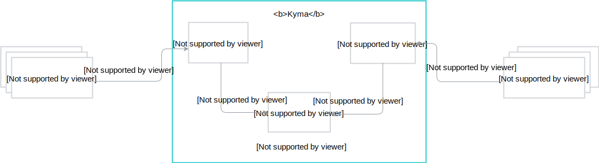

Kyma is built of numerous components but these three drive it forward:

  - **Application Connector**:
    - Simplifies and secures the connection between external systems and Kyma
    - Registers external Events and APIs in the Service Catalog and simplifies the API usage
    - Provides asynchronous communication with services and lambdas deployed in Kyma through Events
    - Manages secure access to external systems
    - Provides monitoring and tracing capabilities to facilitate operational aspects
  - **Serverless**: 
    - Ensures quick deployments following a lambda function approach
    - Enables scaling independent of the core applications
    - Gives a possibility to revert changes without causing production system downtime
    - Supports the complete asynchronous programming model
    - Offers loose coupling of Event providers and consumers
    - Enables flexible application scalability and availability
  - **Service Catalog**:
    - Connects services from external sources
    - Unifies the consumption of internal and external services thanks to compliance with the Open Service Broker standard
    - Provides a standardized approach to managing the API consumption and access
    - Eases the development effort by providing a catalog of API and Event documentation to support automatic client code generation
  

This basic use case shows how the three components work together in Kyma:

