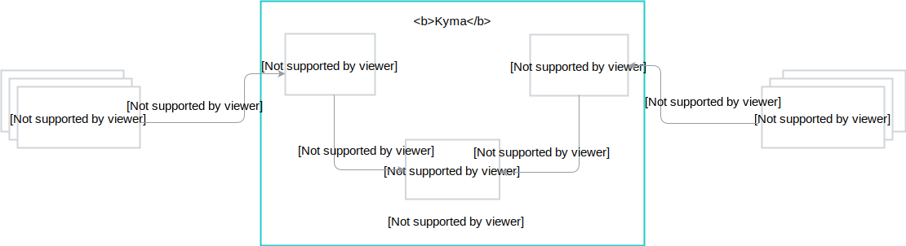

Kyma is built of numerous components but these three drive it forward:

  - **Application Connector** connects external on-premise or cloud-native applications with Kyma and registers their APIs and Events that internal applications or functions can later consume.
  - **Serverless** is based on [Kubeless](https://kubeless.io/) and allows you to write short code snippets, known as functions or lambdas, that consume the Events exposed by the Application Connector and use external services provided by the Service Catalog to trigger certain business logic.
  - **Service Catalog** offers third-party services in the form of ServiceClasses exposed by the Service Brokers that a given function can consume to perform certain actions.

This basic use case shows how the three components work together in Kyma:

