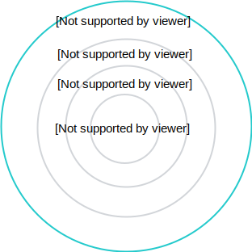

Integration with Knative is a step towards Kyma modularization and the "slimming" approach which aims to extract some out-of-the-box components and provide you with a more flexible choice of tools to use in Kyma.

Both Kyma and Knative are Kubernetes and Istio-based systems that offer development and eventing platforms. The main difference, however, is their focus. While Knative concentrates more on providing the building blocks for running serverless workloads, Kyma focuses on integrating those blocks with external services and applications. The nearest plan for Kyma and Knative cooperation is to provide configuration options to allow Istio deployed with Knative to work on Kyma. Further changes involve extracting Kyma eventing to fully integrate it with Knative eventing. This integration will provide more flexibility on deciding which messaging implementation to use (NATS, Kafka, or any other).

