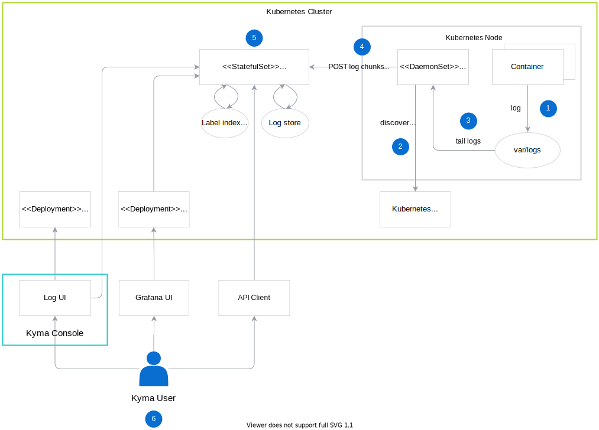

This document provides an overview of the logging architecture in Kyma. 

## Storing and processing logs 

1. The container logs some activity.
2. The logs are stored in the file system in the `var/log` directory.
3. The Agent discovers Pods by querying the [Kubernetes API Server](https://kubernetes.io/docs/reference/command-line-tools-reference/kube-apiserver/) which validates and configures data for objects such as Pods or Services. Thanks to this configuration the Agent knows which containers belong to a particular Pod, and can tail them. 
4. The Agent tails log files stored in the container file system.
5. The Agent enriches the log data with Pod labels and sends them to the Loki server. The log data is organized in log chunks. A log chunk consists of all logs for metadata, such as labels, collected over a certain time period. Log chunks support append, seek, and stream operations on requests.
5. The Loki server processes and stores log data in the log store. The Pod labels are stored in index store and used for filtering. 

## Quering logs

You can use the following ways to query the logs:

* Grafana dashboard - query the logs on the dashboard
* API client to query the log data using the [HTTP API](https://github.com/grafana/loki/blob/master/docs/api.md).
* Log UI accessed right from the Kyma Console.

The agent is responsible for collecting reliable metadata, consistent with the time series or metrics metadata. To achieve this, it uses the same service discovery and relabelling libraries as Prometheus. The agent is used as a Deamon Set to discover targets, create metadata labels, and tail log files to produce a stream of logs. The logs are buffered on the client side and then sent to the service.

## Log chunks

