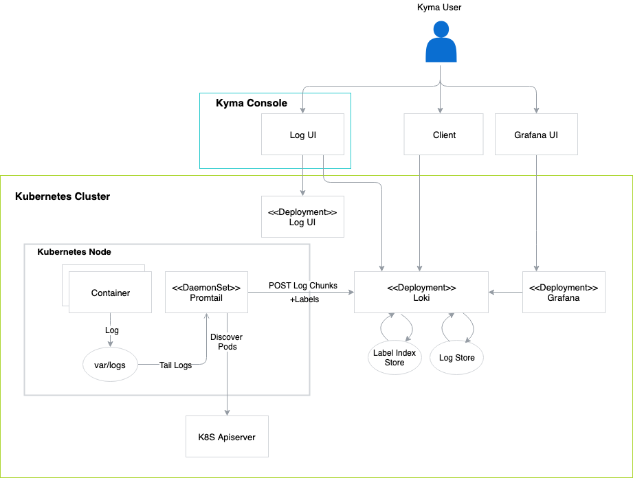

This document provides an overview of the logging architecture in Kyma. 

## Agent (Promtail)
Promtail is the agent responsible for collecting reliable metadata, consistent with the time series or metrics metadata. To achieve this, the agent uses the same service discovery and relabelling libraries as Prometheus. Promtail is used as a Deamon Set to discover targets, create metadata labels, and tail log files to produce a stream of logs. The logs are buffered on the client side and then sent to the service.

## Log chunks
A log chunk consists of all logs for metadata, such as labels, collected over a certain time period. Log chunks support append, seek, and stream operations on requests.

## Life of a write request
The write request path resembles [Cortex](https://github.com/cortexproject/cortex) architecture, using the same server-side components. It looks as follows:
1. The write request reaches the distributor service, which is responsible for distributing and replicating the requests to ingesters. Loki uses the Cortex consistent hash ring and distributes requests based on the hash of the entire metadata set.
2. The write request goes to the log ingester which batches the requests for the same stream into the log chunks stored in memory. When the log chunks reach a predefined size or age, they are flushed out to the Cortex chunk store.
3. The Cortex chunk store will be updated to reduce copying of chunk data on the read and write path and add support for writing chunks of google cloud storage.

## Life of a query request
Log chunks are larger than Prometheus Cortex chunks (Cortex chunks do not exceed 1KB). As a result, you cannot load and decompress them as a whole. 
To solve this problem Loki supports streaming and iterating over the chunks. This means it can decompress only the necessary chunk parts.

For further information, see the [design documentation](https://docs.google.com/document/d/11tjK_lvp1-SVsFZjgOTr1vV3-q6vBAsZYIQ5ZeYBkyM/view).
