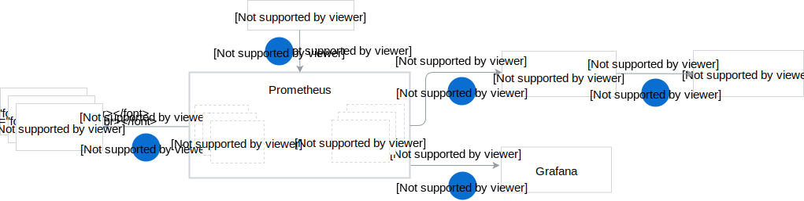

Before you go into component details, find out more about the end-to-end monitoring flow in Kyma.
## End-to-end monitoring flow

The complete monitoring flow in Kyma comes down to these components and steps:

1. Upon Kyma installation on a cluster, Prometheus Operator creates a Prometheus instance with the default configuration.
2. The Prometheus server periodically polls all metrics exposed on `/metrics` endpoints of ports specified in ServiceMonitor CRDs. Prometheus stores these metrics in a time-series database.
3. If Prometheus detects any metric values matching the logic of alerting rules, it triggers the alerts and passes them to Alertmanager.
4. If you manually configure a notification channel, you can instantly receive detailed information on metric alerts detected by Prometheus.
5. You can visualize metrics and track their historical data on Grafana dashboards.

## Monitoring components

The diagram presents monitoring components and the way they interact with one another.

1. [**Prometheus Operator**](https://github.com/coreos/prometheus-operator) creates a Prometheus instance, manages its deployment, and provides configuration for it. It also operates ServiceMonitor custom resources that specify monitoring definitions for groups of services. Prometheus Operator is a prerequisite for installing other core monitoring components, such as the Node Exporter, and the deployment of Alertmanager and Grafana. 

2. [**Prometheus**](https://prometheus.io/docs/introduction) collects metrics from Pods. Metrics are the time-stamped data that provide information on the running jobs, workload, CPU consumption, memory usage, and more. To obtain such metrics, Prometheus uses the [**kube-state-metrics**](https://github.com/kubernetes/kube-state-metrics) service. It generates the metrics from Kubernetes API objects and exposes them on the `/metrics` HTTP endpoint.  
Pods can also contain applications with custom metrics, such as the total storage space available in the MinIO server. Prometheus stores this polled data in a time-series database (TSDB) and runs rules over them to generate alerts if it detects any metric anomalies. It also scrapes metrics provided by [**Node Exporter**](https://github.com/mindprince/nvidia_gpu_prometheus_exporter) which exposes existing hardware metrics from external systems as Prometheus metrics.

3. **ServiceMonitors** monitor services and specify the endpoints from which Prometheus should poll the metrics. Even if you expose a handful of metrics in your application, Prometheus polls only those from the `/metrics` endpoints of ports specified in ServiceMonitor CRDs. 

4. [**Alertmanager**](https://prometheus.io/docs/alerting/alertmanager/) receives alerts from Prometheus and forwards this data to configured Slack or Victor Ops channels.  You can use **PrometheusRules** to define alert conditions for metrics. Kyma provides a set of out-of-the-box alerting rules that are passed from Prometheus to Alertmanager. The definitions of such rules specify the alert logic, the value at which alerts are triggered, the alerts' severity, and more. 

    >**NOTE:** There are no notification channels configured in the default monitoring installation. The current configuration allows you to add either Slack or Victor Ops channels.

5. [**Grafana**](https://grafana.com/docs/guides/getting_started/) provides a dashboard and a graph editor to visualize metrics collected from the Prometheus API. Grafana uses the query language called [PromQL](https://prometheus.io/docs/prometheus/latest/querying/basics/) to select and aggregate metrics data from the Prometheus database. To access the Grafana UI, use the `https://grafana.{DOMAIN}` address, where `{DOMAIN}` is the domain of your Kyma cluster.

