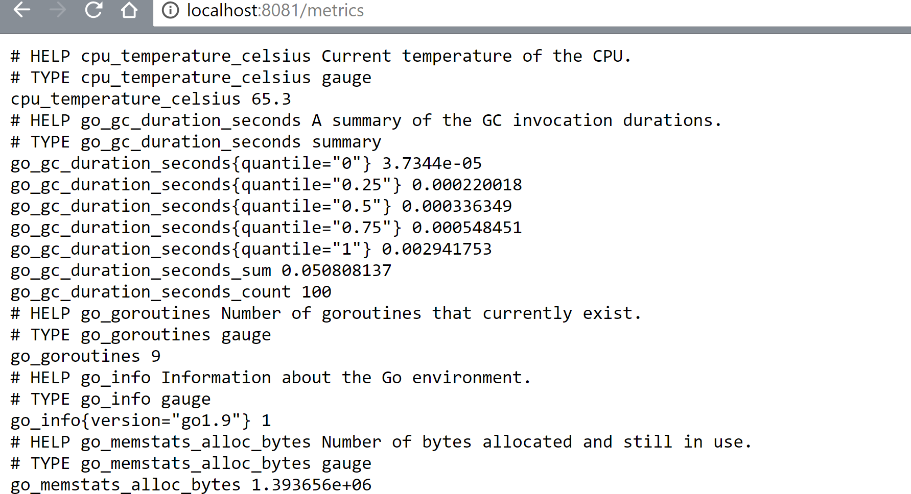
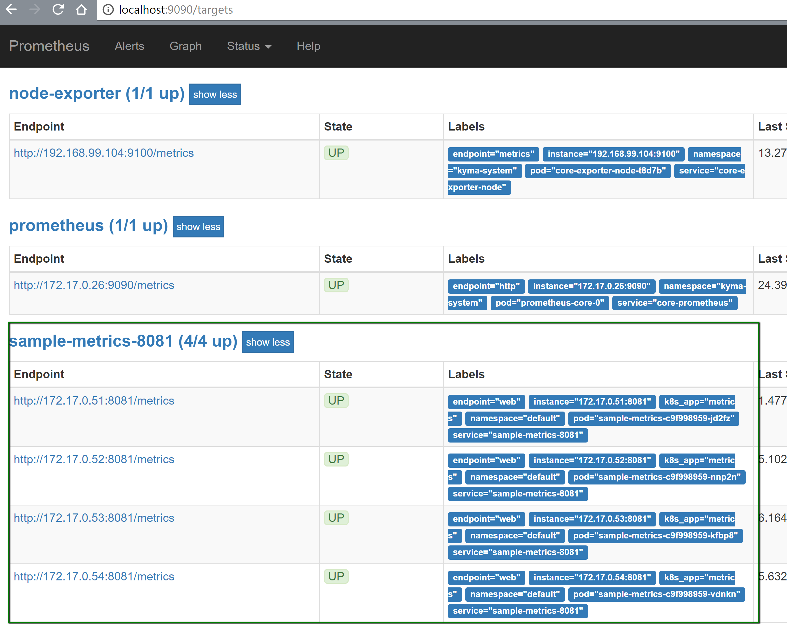
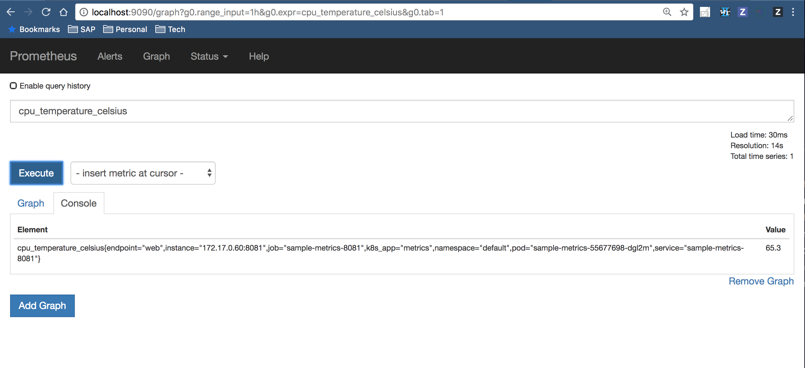

This tutorial shows how you can observe your application metrics. Learn how to list all metrics exposed by a sample Go service and watch their changing values by redirecting the metrics port and the default Prometheus server port to the localhost.

This tutorial uses the [`monitoring-custom-metrics`](https://github.com/kyma-project/examples/tree/master/monitoring-custom-metrics) example and one of its services named `sample-metrics-8081`. The service exposes its metrics on the standard `/metrics` endpoint that is available under port `8081`. You deploy the service (`deployment.yaml`) along with the ServiceMonitor custom resource (`service-monitor.yaml`) that instructs Prometheus to scrape metrics:

- From the service with the `k8s-app: metrics` label
- From the `/metrics` endpoint
- At `10s` interval

This tutorial focuses on the `cpu_temperature_celsius` metric, that is one of the custom metrics exposed by the `sample-metrics-8081` service. Using the metric logic implemented in the example, you can observe how the CPU temperature changes in the range between 60 and 90 degrees Celsius when Prometheus calls the `/metrics` endpoint.

## Prerequisites

To complete the tutorial, you must meet one of these prerequisites and have:

- A cluster with Kyma 1.3 or higher
- Kyma 1.3 or higher installed locally with the Monitoring module

> **NOTE:** The monitoring module is not installed by default as a part of the [Kyma Lite](/root/kyma/#installation-overview) package.

## Steps

Follow this tutorial to:

- Deploy the sample service with its default configuration.
- Redirect the metrics to the localhost.
- Redirect the metrics to the Prometheus server to observe the metrics in the Prometheus UI.
- Clean up the deployed example.

### Deploy the example configuration

Follow these steps:

1. Create the `testing-monitoring` Namespace.

  ```bash
  kubectl create namespace testing-monitoring
  ```

2. Deploy the sample service in the `testing-monitoring` Namespace.

  ```bash
  kubectl create -f https://raw.githubusercontent.com/kyma-project/examples/master/monitoring-custom-metrics/deployment/deployment.yaml --namespace=testing-monitoring
  ```

3. Deploy the ServiceMonitor custom resource definition (CRD) in the `kyma-system` Namespace that is a default Namespace for all ServiceMonitor CRDs.

  ```bash
  kubectl apply -f https://raw.githubusercontent.com/kyma-project/examples/master/monitoring-custom-metrics/deployment/service-monitor.yaml
  ```

4. Test your deployment.
   
  ```bash
  kubectl get pods -n testing-monitoring
  ```

  You should get a result similar to this one:

  ```bash
  NAME                              READY   STATUS    RESTARTS   AGE
  sample-metrics-6f7c8fcf4b-mlgbx   2/2     Running   0          26m
  ```

### View metrics on a localhost

Follow these steps:

1. Run the `port-forward` command on the `sample-metrics-8081` service for port `8081` to check the metrics.

  ```bash
  kubectl port-forward svc/sample-metrics-8081 -n testing-monitoring 8081:8081
  ```

2. Open a browser and access [`http://localhost:8081/metrics`](http://localhost:8081/metrics).

You can see the `cpu_temperature_celsius` metric and its current value of `62` on the list of all metrics exposed by the `sample-metrics-8081` service.



Thanks to the example logic, the custom metric value changes each time you refresh the localhost address.

### View metrics on the Prometheus UI

You can also observe the `cpu_temperature_celsius` metric in the Prometheus UI and see how its value changes in the pre-defined `10s` interval in which Prometheus scrapes the metric values from the service endpoint.

Follow these steps to redirect the metrics:

1. Run the `port-forward` command on the `monitoring-prometheus` service.

  ```bash
  kubectl port-forward svc/monitoring-prometheus -n kyma-system 9090:9090
  ```

2. Access the [Prometheus UI](http://localhost:9090/targets#job-sample-metrics-8081) to see the service endpoint and its details on the **Targets** list.

  

3. Click the **Graph** tab, search for the `cpu_temperature_celsius` metric in the **Expression** search box, and click the **Execute** button to check the last value scraped by Prometheus.

  

  The Prometheus UI shows a new value every 10 seconds upon refreshing the page.

### Clean up the configuration

When you finish the tutorial, remove the deployed example and all its resources from the cluster.

> **NOTE:** Do not clean up the resources if you want to continue with the next tutorial as these resources are used there as well.

Follow these steps:

1. Remove the deployed ServiceMonitor CRD from the `kyma-system` Namespace.

  ```bash
  kubectl delete servicemonitor -l example=monitoring-custom-metrics -n kyma-system
  ```

2. Remove the example deployment from the `testing-monitoring` Namespace.

  ```bash
  kubectl delete all -l example=monitoring-custom-metrics -n testing-monitoring
  ```

3. Remove the `testing-monitoring` Namespace.

  ```bash
  kubectl delete namespace testing-monitoring
  ```
