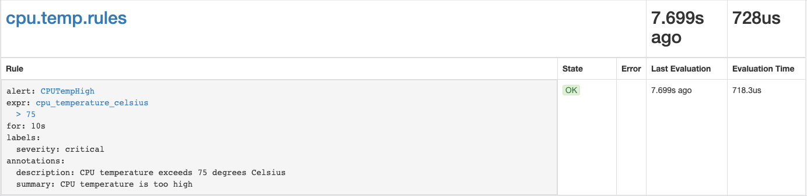
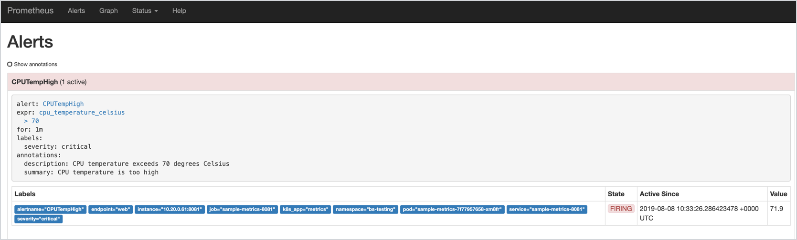

This tutorial shows you how to define alerting rules to monitor the health status of your resources. In this example, you will write an alerting rule based on the `cpu_temperature_celsius` metric. The alert defined in the rule will fire whenever the CPU temperature exceeds 70 degrees Celsius.

## Prerequisites

This tutorial is a follow-up of the [Observe application metrics](components/monitoring/#tutorials-expose-custom-metrics-in-kyma) tutorial that uses the `monitoring-custom-metrics` example. Follow this tutorial to deploy the `sample-metrics-8081` service which exposes the `cpu_temperature_celsius` metric. That configuration is required to complete this tutorial.

## Steps

Follow these steps to create an alerting rule:

1. Create a PrometheusRule resource holding the configuration of your alerting rule. 

>**NOTE**: Prometheus uses the **spec.ruleSelector** label selector to identify PrometheusRule definitions. Provide the values for the **prometheus** and **role** parameters as in the example for Prometheus to pick up the rule.

```yaml
apiVersion: monitoring.coreos.com/v1
kind: PrometheusRule
metadata:
  name: cpu.temp.rules
  labels:
    app: cpu.temp.rules
    prometheus: monitoring
    release: monitoring
    role: alert-rules
spec:
  groups:
  - name: cpu.temp.rules
    rules:
    - alert: CPUTempHigh
      expr: cpu_temperature_celsius > 70 
      for: 60s
      labels:
        severity: critical
      annotations:
        description: "CPU temperature exceeds 70 degrees Celsius"
        summary: "CPU temperature is too high"
```
Configure your alert using the following parameters:

| Parameter | Description | Example value |
|-----------|-------------|---------------|
| **alert** | Specifies the name of the alert. | `CPUTempHigh`  |
| **expr** | A PromQL expression specifying the conditions that must be met for the alarm to fire. Specify the expression using Kubernetes [functions](https://prometheus.io/docs/prometheus/latest/querying/functions/) and [metrics](https://github.com/kubernetes/kube-state-metrics/blob/master/Documentation/pod-metrics.md). | `cpu_temperature_celsius > 70`  |
| **for** | Specifies the time period between encountering an active alert for the first time during rule evaluation and firing the alert.  | `60s` |
| **description** | Provides the alert details. | `CPU temperature exceeds 70 degrees Celsius` |
| **summary** | Provides a short alert summary. | `CPU temperature is too high` |

For more details on defining alerting rules, see [this](https://prometheus.io/docs/prometheus/latest/configuration/alerting_rules/) document.

3. Deploy the alerting rule:

```bash
kubectl apply -f test-rules.yaml
```
4. Run the port-forward command on the monitoring-prometheus service to access the Prometheus dashboard:

  ```bash
  kubectl port-forward pod/prometheus-monitoring-0 -n kyma-system 9090:9090
  ```
5. Go to [`http://localhost:9090/rules`](http://localhost:9090/rules) to view the rule in the dashboard.



6. Go to [`http://localhost:9090/alerts`](http://localhost:9090/alerts) to see if the alert fires properly.

