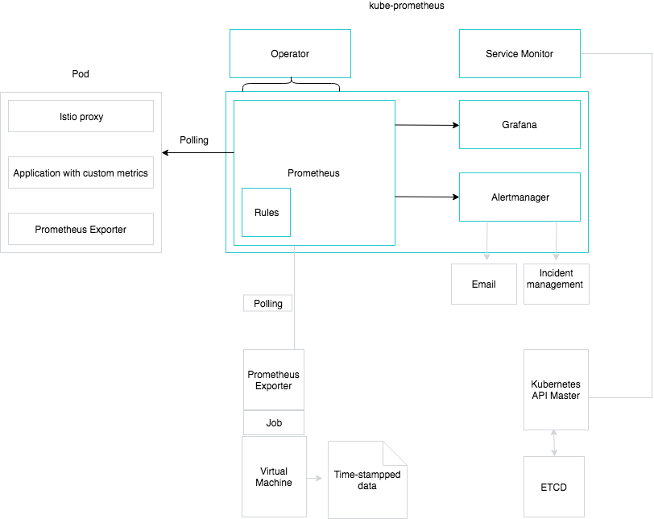

This document outlines the monitoring architecture of Kyma, highlighting information sources that Prometheus polls for data to process.

## The Prometheus Operator

The Prometheus Operator is a CoreOS component integrated into Kyma that enables Prometheus deployments to be decoupled from the configuration of the entities they monitor. The task of the Operator is to ensure that Prometheus servers with the specified configuration are always running. If the developer does not specify a configuration for Prometheus instances, the Operator is able to generate and deploy one. The Prometheus instance is responsible for the monitoring of services.

## The Service Monitor

The Service Monitor works in orchestration with the Prometheus resource that the Operator watches. It dictates to a Prometheus resource how to retrieve metrics and enables exposure of those metrics in a standard manner. It also specifies services the Prometheus instance should monitor. Using labels, the Prometheus resource includes a Service Monitor.  

## Monitored Data sources

Prometheus contains the flexibility to poll data from a variety of sources. Virtual machines on which Kubernetes runs make time-stamped data available, reporting on jobs started, workload, CPU performance, capacity, and more. In this case, the Service Monitor watches the Kubernetes API master to detect any job creation. The job produces time-stamped data that Prometheus consumes.

Pods may contain applications with custom metrics that Prometheus can poll through the Prometheus exporter.

## Grafana

Kyma employs Grafana as a third-party resource in `kube-prometheus` to deliver a feature-rich metrics dashboard and graph editor.

To access the Grafana UI, use the following URL: `https://grafana.{DOMAIN}`. Replace DOMAIN with the domain of your Kyma cluster.

## Alertmanager

Alertmanager receives harvested metrics from Prometheus and forwards this data on to the configured channels, such as email or incident management systems.
