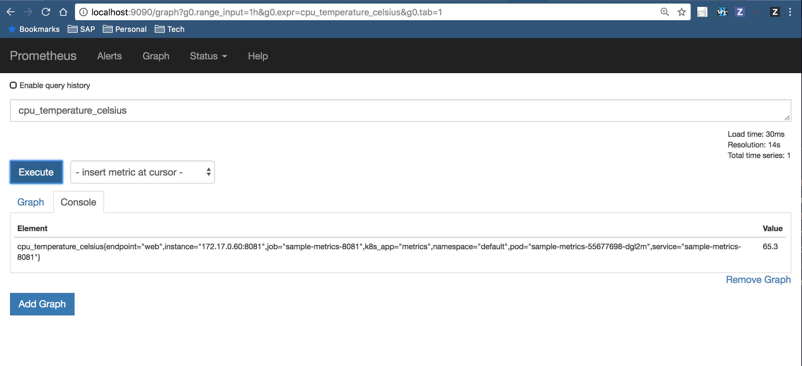

## Overview

This Getting started guide shows how to expose custom metrics to Prometheus with a Golang service in Kyma. To do so, follow these steps:

1. Configure Istio
2. Expose a sample application serving metrics on Port 8081.
3. Access the exposed metrics in Prometheus

## Prerequisites

- Kyma as the target deployment environment.
- Istio 0.8
  - Sidecar injection must be enabled ```istio-injection: "enabled"```
  - Mutual TLS enabled.

## Installation

### Configure Istio

Sidecar injection must be enabled, `istio-injection: "enabled"`
for the `default` Namespace.

To enable sidecar injection for all the pods running in the `default` Namespace, run the command below.

```bash
kubectl label namespace default istio-injection=enabled
namespace "default" labeled
```

More details on deploying your application with Istio is [here](https://istio.io/docs/setup/kubernetes/quick-start#deploy-your-application) .

It is needed to add the `sidecar.istio.io/inject` annotation with value `true` to the pod template spec to enable injection as done [here](https://github.com/kyma-project/examples/blob/master/monitoring-custom-metrics/deployment/deployment.yaml#L12).


```yaml
spec:
  template:
    metadata:
      annotations:
        sidecar.istio.io/inject: "true"
```

More details on installing the Istio Sidecar is here [here](https://istio.io/docs/setup/kubernetes/sidecar-injection/#policy).

Following ports are used in the pod:
1. Port: **8080**, as envoy will capture traffic only for ports listed in containerPorts of the pod, `containerPort: 8080`, or the list of ports in the annotation `traffic.sidecar.istio.io/includeInboundPorts`. Thus, this port is a part of the service mesh and can be used for application needs.

2. Port: **8081**, the excluded port from service mesh and is used for exposing metrics only. So the network traffic **bypasses** Envoy and goes straight to the container. In Kyma, use the suggested port `8081` to expose metrics.

### Expose a sample metrics application

In order to expose prometheus metrics in Golang the prometheus community provides a library, [client_golang](https://github.com/prometheus/client_golang).

This example has taken a basic example where `Gauge` and `Counter` metrics are exported using the package `prometheus`.

1. Deploy the sample metrics application
    ```bash
    kubectl apply -f https://raw.githubusercontent.com/kyma-project/examples/master/monitoring-custom-metrics/deployment/deployment.yaml
    
    kubectl apply -f https://raw.githubusercontent.com/kyma-project/examples/master/monitoring-custom-metrics/deployment/service-8080.yaml
    
    kubectl apply -f https://raw.githubusercontent.com/kyma-project/examples/master/monitoring-custom-metrics/deployment/service-8081.yaml

    kubectl apply -f https://raw.githubusercontent.com/kyma-project/examples/master/monitoring-custom-metrics/deployment/service-monitor.yaml
    ```

    ```bash
    kubectl get pods
    NAME                             READY     STATUS    RESTARTS   AGE
    sample-metrics-c9f998959-jd2fz   2/2       Running   0          2m
    sample-metrics-c9f998959-kfbp8   2/2       Running   0          2m
    sample-metrics-c9f998959-nnp2n   2/2       Running   0          2m
    sample-metrics-c9f998959-vdnkn   2/2       Running   0          2m
    ```

2. Run the `port-forward` on the sample-metrics-8081 Service for port 8081 to check the metrics
    ```bash
    kubectl port-forward svc/sample-metrics-8081 8081:8081
    ```
    Then open a browser and access [`http://localhost:8081/metrics`](http://localhost:8081/metrics)
    

The source code for the sample application is [here](https://github.com/kyma-project/examples/blob/master/monitoring-custom-metrics/main.go).

- See [package prometheus](https://godoc.org/github.com/prometheus/client_golang/prometheus) for its reference documentation.

- Learn more on [prometheus metric types](https://prometheus.io/docs/concepts/metric_types/).

### Access the exposed metrics in Prometheus

 Run the `port-forward` command on the `core-prometheus` service:
    
```bash
kubectl port-forward svc/core-prometheus -n kyma-system 9090:9090
Forwarding from 127.0.0.1:9090 -> 9090
Forwarding from [::1]:9090 -> 9090
```
All the **sample-metrics** endpoints appear as the [`Targets`](http://localhost:9090/targets#job-sample-metrics-8081) list.


Use either `cpu_temperature_celsius` or `hd_errors_total` in the **expression** field in [here](http://localhost:9090/graph) and click the `Execute` button to check the values scrapped by Prometheus.


### ServiceMonitor

With the help of ServiceMonitor, Prometheus is able to reach the service. A ServiceMonitor is a specific CRD used by the prometheus operator to monitor services.

In Kyma the prometheus server discovers all ServiceMonitors through a ```serviceMonitorSelector:``` matching the label ```prometheus: core```

```yaml
  serviceMonitorSelector:
    matchLabels:
      prometheus: {{ .Values.prometheusLabelValue | default .Release.Name | quote }}
{{- end }}
```

In our example, the ServiceMonitor selects ```selector:```with all Services matching a label, ```k8s-app: metrics```. The complete yaml is [here](https://github.com/kyma-project/examples/blob/master/monitoring-custom-metrics/deployment/service-monitor.yaml).

In Kyma we have a template, [kyma/resources/core/charts/monitoring/charts/prometheus/templates/servicemonitors.yaml](https://github.com/kyma-project/kyma/blob/master/resources/core/charts/monitoring/charts/prometheus/templates/servicemonitors.yaml), which is ```kind: List``` to discover a list of ServiceMonitors.

### Adding Custom Dashboard in Grafana

As mentioned, Kyma includes a set of dashboards. However, users can create their own **Grafana Dashboard** by using the Grafana UI as the dashboards are persisted even after the pod restarts.

For details of how to create dashboards in Grafana, see the following:
- [Grafana in Kyma](https://github.com/kyma-project/kyma/blob/master/resources/core/charts/monitoring/charts/grafana/README.md)
- [Grafana - Getting started](http://docs.grafana.org/guides/getting_started/)
- [Export and Import dashboards](http://docs.grafana.org/reference/export_import/)
- [Grafana - Dashboard API](http://docs.grafana.org/http_api/dashboard/)

### Cleanup
Run the following commands to completely remove the example and all its resources from the cluster:

1. Remove the **istio-injection** label from the `default` Namespace.
    ```bash
    kubectl label namespace default istio-injection-
    ```
2. Remove **ServiceMonitor** in the `kyma-system` Namespace.
    ```bash
    kubectl delete servicemonitor -l example=monitoring-custom-metrics -n kyma-system
    ```
3. Remove the `sample-metrics` Deployments in the `default` Namespace.
    ```bash
    kubectl delete all -l example=monitoring-custom-metrics
