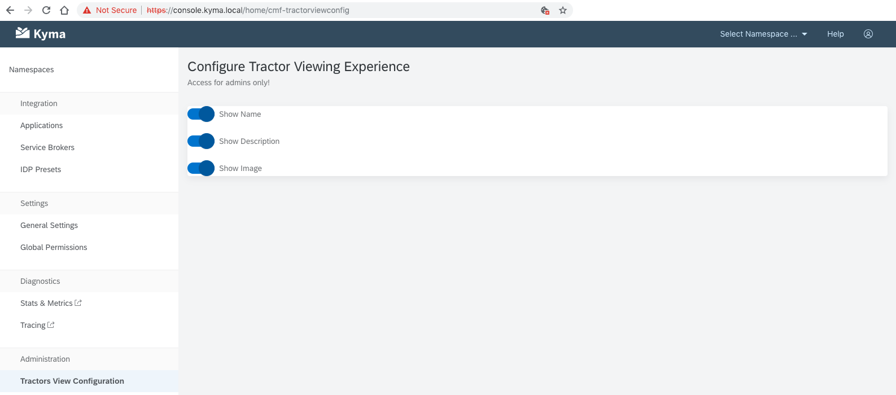

The Kyma Console UI uses the [Luigi framework](https://github.com/kyma-project/luigi) to allow you to seamlessly extend the UI content with custom micro frontends.

## Console UI interaction with micro frontends

When rendering the navigation, the Kyma Console UI calls a dedicated API endpoint to check if there are any micro frontends defined in the current context. The current context comprises the current Namespace and all global cluster micro frontends. All the defined micro frontends and cluster micro frontends are mapped to the navigation model as navigation nodes with remote **viewUrls**. When you click the navigation node, the system loads the content of the micro frontend into the content area of the Console. At the same time, the Console sends the current context data to the micro frontend to ensure it is initialized properly.

## Micro frontend

A micro frontend is a standalone web application which is developed, tested and deployed independently from the Kyma Console application. It uses the Luigi Client library to ensure proper communication with the Console application. When you implement and deploy a micro frontend, you can plug it to the Kyma Console as a UI extension using dedicated CustomResourceDefinitions.

### Luigi Client

The Luigi Client enables communication between the micro frontend and the Console application.
Include [Luigi Client](https://www.npmjs.com/package/@kyma-project/luigi-client) in the micro frontend's codebase as an npm dependency.

``` bash
npm i @kyma-project/luigi-client
```

It helps to read the context data that is sent by the Console when the user activates the micro frontend in the UI.
Use the following example to read the context data:

``` js
LuigiClient.addInitListener((data)=>{
    // do stuff with the context data
});
```

The Luigi Client facilitates communication between the micro frontend and the Console. Use the Luigi Client API to request the Console to navigate from the micro frontend to any other route available in the application:

``` js
LuigiClient.linkManager().navigate('/targetRoute', null, true)
```

For API details, see [Luigi Client API documentation](https://github.com/kyma-project/luigi/blob/master/docs/luigi-client-api.md).

## Add a micro frontend

Use the CustomResourceDefinitions to extend the Console functionality and configure different scopes for your micro frontends.

### Micro frontend for a specific Namespace

You can define a micro frontend visible only in the context of a specific Namespace.

See the [`mf-namespaced.yaml`](./assets/mf-namespaced.yaml) file for a sample micro frontend entity using the **namespace** metadata attribute to enable the micro frontend **only** for the production Namespace.

Using this yaml file in your Kyma cluster results in a **Tractors Overview** micro frontend navigation node displayed under the **Hardware** category. It is available **only** in the production Namespace.


### Cluster-wide micro frontend

You can define a cluster-wide micro frontend available for all Namespaces in the side navigation.

See the [`cmf-environment.yaml`](./assets/cmf-environment.yaml) file for a sample ClusterMicroFrontend entity using the `namespace` value for the **placement** attribute to make the micro frontend available for all Namespaces in the cluster.

Using this yaml file in your Kyma cluster results in a **Tractors Overview** micro frontend navigation node displayed under the **Hardware** category. It is available **for every** Namespace in your cluster.

### Cluster-wide micro frontend for the administration section
You can define a cluster micro frontend visible in the **Administration** section of the Console.

See the [`cmf-cluster.yaml`](./assets/cmf-cluster.yaml) for a sample ClusterMicroFrontend entity using the `cluster` value for placement  **attribute** to ensure the micro frontend is visible in the **Administration** section.


