This diagram shows a high-level overview of how Rafter works:

>**NOTE:** This flow also applies to the cluster-wide counterparts of all CRs.

1. The user creates a Bucket CR. This propagates the creation of buckets in MinIO Gateway where assets will be stored.
2. The user creates an Asset CR that contains the reference to assets.
3. Services implemented for Rafter webhooks optionally validate, mutate, or extract data from assets before uploading them into buckets.
4. Rafter uploads assets into buckets in MinIO Gateway.

Read more about the role of main Rafter components and controllers that manage them:

- **Asset custom resource** (CR) is an obligatory [CR](#custom-resource-asset) in which you define the asset you want to store in a given storage bucket. Its definition requires the asset name and mode, the name of the Namespace in which it is available, the address of its web location, and the name of the bucket in which you want to store it. Optionally, you can specify the validation and mutation requirements that the asset must meet before it is stored.

- **Asset Controller** (AC) manages the [Asset CR lifecycle](#details-asset-custom-resource-lifecycle).

- **AssetGroup custom resource** (CR) orchestrates the creation of multiple Asset CRs in a given Namespace.

- **AssetGroup Controller** creates Asset custom resources (CRs) based on an AssetGroup CR definition. If the AssetGroup CR defines two sources of assets, such as `asyncapi` and `markdown`, the AssetGroup Controller creates two Asset CRs. The AssetGroup Controller also monitors the status of the Asset CR and updates the status of the AssetGroup CR accordingly.

- **Bucket CR** is an obligatory [CR](#custom-resource-bucket) in which you define the name of the bucket for storing assets.

- **Bucket Controller** manages the [Bucket CR lifecycle](#details-bucket-custom-resource-lifecycle).

- **Validation Service** is an optional service which ensures that the asset meets the validation requirements specified in the Asset CR before uploading it to the bucket. The service returns the validation status to the AC. See the example of the [AsyncAPI Service](#details-asyncapi-service).

- **Mutation Service** is an optional service which ensures that the asset is modified according to the mutation specification defined in the Asset CR before it is uploaded to the bucket. The service returns the modified asset to the AC. See the example of the [AsyncAPI Service](#details-asyncapi-service).

- **Extraction Service** is an optional service which extracts metadata from assets. The metadata information is stored in the CR status. The service returns the asset metadata to the AC. See the example of the [Front Matter Service](#details-front-matter-service).

- **MinIO Gateway** is a MinIO cluster mode which is a production-scalable storage solution. It ensures flexibility of using asset storage services from major cloud providers, including Azure Blob Storage, Amazon S3, and Google Cloud Storage.

>**NOTE:** All CRs and controllers have their cluster-wide counterparts, names of which start with the **Cluster** prefix, such as ClusterAssetGroup CR.
