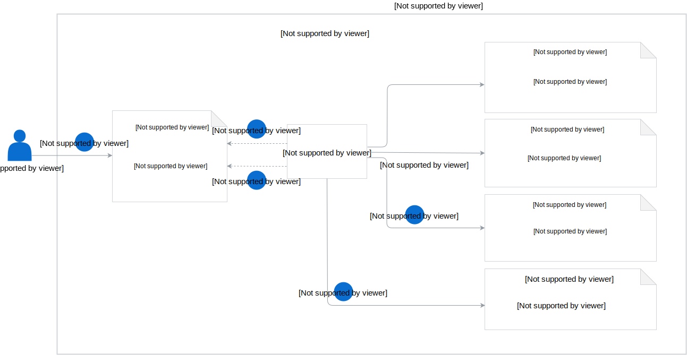

This diagram provides more details of the AssetGroup CR flow, the controller that manages it, and underlying processes:

>**NOTE:** This flow also applies to the ClusterAssetGroup CR.

1. The user creates an AssetGroup CR in a given Namespace.
2. The AssetGroup Controller reads the AssetGroup CR definition.
3. If the AssetGroup CR definition does not provide a reference name (**bucketRef**) of the Bucket CR, the AssetsGroup Controller checks if the default Bucket CR already exists in this Namespace. If it does not exist yet, the AssetsGroup Controller creates a new Bucket CR with:

- the `rafter-public-{ID}` name, where `{ID}` is a randomly generated string, such as `rafter-public-6n32wwj5vzq1k`.
- the **rafter.kyma-project.io/default: true** label
- the **rafter.kyma-project.io/access: public** label

4. The AssetGroup Controller creates Asset CRs in the number corresponding to the number of sources specified in the AssetGroup CR. It adds **rafter.kyma-project.io/source-type** and **rafter.kyma-project.io/asset-group** labels to every Asset CR definition. It also adds the bucket name under the **bucketRef** field to every Asset CR definition.
5. The AssetGroup Controller verifies if the Asset CRs are in the `Ready` phase and updates the status of the AssetGroup CR accordingly. It also adds the bucket reference name to the AssetGroup CR.
