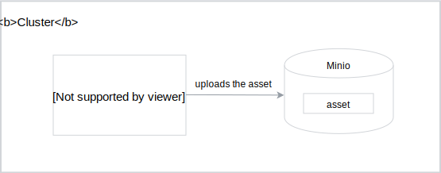
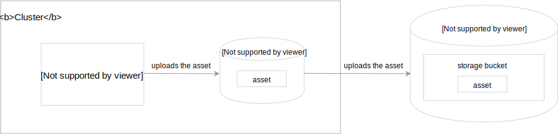

The whole concept of Rafter relies on MinIO as the storage solution. It supports Kyma's manifesto and the "batteries included" rule by providing you with this on-premise solution by default.

Depending on the usage scenario, you can:

- Use MinIO for local development.
- Store your assets on a production scale using MinIO in [Gateway mode](https://github.com/minio/minio/tree/master/docs/gateway).

Rafter ensures that both usage scenarios work for Kyma, without additional configuration of the built-in controllers.

## Development mode storage

MinIO is an open-source asset storage server with Amazon S3-compatible API. You can use it to store various types of assets, such as documents, files, or images.

In the context of Rafter, the Asset Controller stores all assets in MinIO, in dedicated storage space.



## Production storage

For the production purposes, Rafter uses MinIO Gateway which:

- Is a multi-cloud solution that offers the flexibility to choose a given cloud provider for the specific Kyma installation, including Azure, Amazon, and Google.
- Allows you to use various cloud providers that support the data replication and CDN configuration.
- Is compatible with Amazon S3 APIs.



>**TIP:** Every cloud provider offers a different payment policy for storing buckets. To avoid unexpected costs, verify the payment policy with the given provider before you start using Gateway mode. To reduce the costs in general, always try to limit the number of buckets and create them for groups and domains rather than separate assets.

See [this tutorial](#tutorials-set-minio-to-gateway-mode) to learn how to set MinIO to Google Cloud Storage Gateway mode.

## Access MinIO credentials

For security reasons, MinIO credentials are generated during Kyma installation and stored inside the Kubernetes Secret object. You can obtain both the access key and the secret key in the development (MinIO) and production (MinIO Gateway) mode using the same commands.

- To get the access key, run:

<div tabs name="access-minio-credentials" group="credentials">
  <details>
  <summary label="MacOS">
  MacOS
  </summary>

  ```bash
  kubectl get secret rafter-minio -n kyma-system -o jsonpath="{.data.accesskey}" | base64 -D
  ```

  </details>
  <details>
  <summary label="Linux">
  Linux
  </summary>

  ```bash
  kubectl get secret rafter-minio -n kyma-system -o jsonpath="{.data.accesskey}" | base64 -d
  ```

  </details>
</div>

- To get the secret key, run:

<div tabs name="access-minio-credentials" group="credentials">
  <details>
  <summary label="MacOS">
  MacOS
  </summary>

  ```bash
  kubectl get secret rafter-minio -n kyma-system -o jsonpath="{.data.secretkey}" | base64 -D
  ```

  </details>
  <details>
  <summary label="Linux">
  Linux
  </summary>

  ```bash
  kubectl get secret rafter-minio -n kyma-system -o jsonpath="{.data.secretkey}" | base64 -d
  ```

  </details>
</div>

You can also set MinIO credentials directly using `values.yaml` files. For more details, see the official [MinIO documentation](https://github.com/helm/charts/tree/master/stable/minio#configuration).
