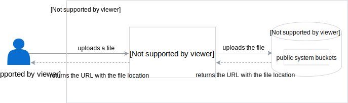

The Upload Service is an HTTP server that exposes the file upload functionality for MinIO. It contains a simple HTTP endpoint which accepts `multipart/form-data` forms. It can upload files to the private and public system buckets.

The main purpose of the service is to provide a solution for hosting static files for components that use Rafter, such as the Application Connector.
You can also use the Upload Service for development purposes to host files for Rafter, without the need to rely on external providers.

## System buckets

The Upload Service creates two system buckets, `system-private-{generated-suffix}` and `system-public-{generated-suffix}`, where `{generated-suffix}` is a Unix nano timestamp in the 32-base number system. The public bucket has a read-only policy specified.

To enable the service scaling and to maintain the bucket configuration data between the application restarts, the Upload Service stores its configuration in the `rafter-upload-service` ConfigMap.

Once you upload the files, system buckets store them permanently. There is no policy to clean system buckets periodically.

The diagram describes the Upload Service flow:



## Use the service outside the Kyma cluster

You can expose the service for development purposes. To use the Upload Service on a local machine, run the following command:

```bash
kubectl port-forward deployment/rafter-upload-service 3000:3000 -n kyma-system
```

You can access the service on port `3000`.

### Upload files

To upload files, send the multipart form **POST** request to the `/v1/upload` endpoint. The endpoint recognizes the following field names:

- `private` that is an array of files to upload to a private system bucket.
- `public` that is an array of files to upload to a public system bucket.
- `directory` that is an optional directory for storing the uploaded files. If you do not specify it, the service creates a directory with a random name. If the directory and files already exist, the service overwrites them.

To do the multipart request using `curl`, run the following command:

```bash
curl -v -F directory='example' -F private=@sample.md -F private=@text-file.md -F public=@archive.zip http://localhost:3000/v1/upload
```

The result is as follows:

```json
{
   "uploadedFiles": [
      {
         "fileName": "text-file.md",
         "remotePath": "https://{STORAGE_ADDRESS}/private-1b0sjap35m9o0/example/text-file.md",
         "bucket": "private-1b0sjap35m9o0",
         "size": 212
      },
      {
         "fileName": "archive.zip",
         "remotePath": "https://{STORAGE_ADDRESS}/public-1b0sjaq6t6jr8/example/archive.zip",
         "bucket": "public-1b0sjaq6t6jr8",
         "size": 630
      },
      {
         "fileName": "sample.md",
         "remotePath": "https://{STORAGE_ADDRESS}/private-1b0sjap35m9o0/example/sample.md",
         "bucket": "private-1b0sjap35m9o0",
         "size": 4414
      }
   ]
}
```

See the [OpenAPI specification](./assets/upload-service-openapi.yaml) for the full API documentation.
