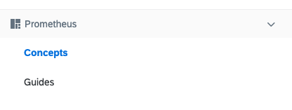

This tutorial shows how you can customize the Documentation view that is available in the Console UI under the question mark icon on the top navigation panel. The purpose of this tutorial is to create a new **Prometheus** documentation section that contains **Concepts** and **Guides** documentation topics with a set of Markdown subdocuments. The Markdown sources used in this tutorial point to specific topics in the official Prometheus documentation.  

>**NOTE:** The Documentation view only displays documents uploaded through ClusterAssetGroup CRs. Make sure they have valid [definitions](#custom-resource-clusterassetgroup) and that the Markdown documents they render have correct [metadata and structure](#details-markdown-documents).

## Prerequisites

- Kyma
- [kubectl](https://kubernetes.io/docs/tasks/tools/install-kubectl/)

## Steps

1. Open the terminal and create these ClusterAssetGroup custom resources:

   ```yaml
   cat <<EOF | kubectl apply -f -
   apiVersion: rafter.kyma-project.io/v1beta1
   kind: ClusterAssetGroup
   metadata:
     labels:
       rafter.kyma-project.io/view-context: docs-ui # This label specifies that you want to render documents in the Documentation view.
       rafter.kyma-project.io/group-name: prometheus # This label defines the group under which you want to render the given asset in the Documentation view. The value cannot include spaces.
       rafter.kyma-project.io/order: "1" # This label specifies the position of the ClusterAssetGroup in relation to other ClusterAssetGroups in the Prometheus section.
     name: prometheus-concepts
   spec:
     displayName: "Concepts" # The name of the topic that shows in the Documentation view under the main Prometheus section.
     description: "Some docs about Prometheus concepts"
     sources:
       - type: markdown # This type indicates that the Asset Metadata Service must extract Front Matter metadata from the source Prometheus documents and add them to a ClusterAssetGroup as a status.
         name: docs
         mode: package # This mode indicates that the source file is compressed and the Asset Controller must unpack it first to process it.
         url: https://github.com/prometheus/docs/archive/master.zip # The source location of Prometheus documents.
         filter: content/docs/concepts # The exact location of the documents that you want to extract.
   ---
   apiVersion: rafter.kyma-project.io/v1beta1
   kind: ClusterAssetGroup
   metadata:
     labels:
       rafter.kyma-project.io/view-context: docs-ui
       rafter.kyma-project.io/group-name: prometheus
       rafter.kyma-project.io/order: "2"
     name: prometheus-guides
   spec:
     displayName: "Guides"
     description: "Some docs about Prometheus guides"
     sources:
       - type: markdown
         name: docs
         mode: package
         url: https://github.com/prometheus/docs/archive/master.zip
         filter: content/docs/guides
   EOF
   ```

   >**NOTE:** For a detailed explanation of all parameters, see the [ClusterAssetGroup custom resource](#custom-resource-clusterassetgroup).

2. Check the status of custom resources:

   ```bash
   kubectl get clusterassetgroups
   ```

   The custom resources should be in the `Ready` phase:

   ```
   NAME                                   PHASE   AGE
   prometheus-concepts                    Ready   59s
   prometheus-guides                      Ready   59s
   ```

   If a given custom resource is in the `Ready` phase and you want to get details of the created ClusterAssets, such as document names and the location of MinIO buckets, run this command:

   ```bash
   kubectl get clusterasset -o yaml -l rafter.kyma-project.io/asset-group=prometheus-concepts
   ```

   The command lists details of the ClusterAsset created by the **prometheus-concepts** custom resource:

   ```yaml
   apiVersion: v1
   items:
   - apiVersion: rafter.kyma-project.io/v1beta1
     kind: ClusterAsset
     metadata:
       annotations:
         rafter.kyma-project.io/asset-short-name: docs
       creationTimestamp: "2019-05-15T13:27:11Z"
       finalizers:
       - deleteclusterasset.finalizers.rafter.kyma-project.io
       generation: 1
       labels:
         rafter.kyma-project.io/asset-group: prometheus-concepts
         rafter.kyma-project.io/type: markdown
       name: prometheus-concepts-docs-markdown-1b7mu6bmkmse4
       ownerReferences:
       - apiVersion: rafter.kyma-project.io/v1beta1
         blockOwnerDeletion: true
         controller: true
         kind: ClusterAssetGroup
         name: prometheus-concepts
         uid: 253c311b-7715-11e9-b241-1e5325edb3d6
       resourceVersion: "6785"
       selfLink: /apis/rafter.kyma-project.io/v1beta1/clusterassets/prometheus-concepts-docs-markdown-1b7mu6bmkmse4
       uid: 253eee7d-7715-11e9-b241-1e5325edb3d6
     spec:
       bucketRef:
         name: rafter-public-1b7mtf1de5ost
       source:
         filter: content/docs/concepts
         metadataWebhookService:
         - endpoint: /v1/extract
           filter: \.md$
           name: rafter-front-matter-service
           namespace: kyma-system
         mode: package
         url: https://github.com/prometheus/docs/archive/master.zip
     status:
       assetRef:
         baseUrl: https://storage.kyma.local/rafter-public-1b7mtf1de5ost-1b7mtf1h187r7/prometheus-concepts-docs-markdown-1b7mu6bmkmse4
         files:
         - metadata:
             sort_rank: 1
             title: Data model
           name: docs-master/content/docs/concepts/data_model.md
         - metadata:
             nav_icon: flask
             sort_rank: 2
             title: Concepts
           name: docs-master/content/docs/concepts/index.md
         - metadata:
             sort_rank: 3
             title: Jobs and instances
           name: docs-master/content/docs/concepts/jobs_instances.md
         - metadata:
             sort_rank: 2
             title: Metric types
           name: docs-master/content/docs/concepts/metric_types.md
       lastHeartbeatTime: "2019-05-15T13:27:24Z"
       message: Asset content has been uploaded
       observedGeneration: 1
       phase: Ready
       reason: Uploaded
   kind: List
   metadata:
     resourceVersion: ""
     selfLink: ""
   ```

   In the **status** section of the ClusterAsset, you can see details of all documents and **baseUrl** with their location in MinIO:

   ```yaml
   status:
     assetRef:
       baseUrl: https://storage.kyma.local/rafter-public-1b7mtf1de5ost-1b7mtf1h187r7/prometheus-concepts-docs-markdown-1b7mu6bmkmse4
       files:
       - metadata:
           sort_rank: 1
           title: Data model
         name: docs-master/content/docs/concepts/data_model.md
   ```

3. Open the Console UI and navigate to the Documentation view. The new **Prometheus** section with **Concepts** and **Guides** topic groups and alphabetically ordered Markdown documents appears at the bottom of the documentation panel:

   

   >**NOTE:** Since the source Markdown documents are prepared for different UIs and can contain custom tags, there can be issues with rendering their full content. If you prepare your own input, use our [content guidelines](https://github.com/kyma-project/community/tree/master/guidelines/content-guidelines) to make sure the documents render properly in the Console UI.

## Troubleshooting

If you apply the ClusterAssetGroup custom resource but its status stays `Pending` or shows `Failed`, check the status details.

This command lists details of the `prometheus-concepts` ClusterAssetGroup:

```bash
kubectl get clusterasset -o yaml -l rafter.kyma-project.io/asset-group=prometheus-concepts
```

See the status details sample:

```yaml
status:
  phase: Failed
  reason: ValidationFailed
  message: "The file is not valid against the provided json schema"
```

You can also analyze logs of the Rafter Controller Manager:

```bash
kubectl -n kyma-system logs -l 'app.kubernetes.io/name=rafter-controller-manager'
```
