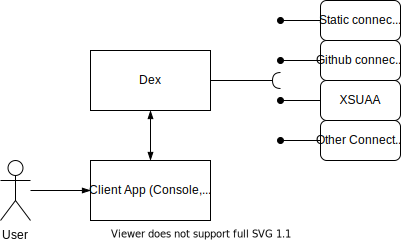

## User authentication
In Kyma the identity federation is managed through [Dex](https://github.com/dexidp/dex), which is an open-source, [OpenID Connect](https://openid.net/connect/) identity provider.



1. The user accesses some application (f.e the Kyma Console). If the Console application doesn't find a JWT token in the browser session storage, it redirects the user's browser to the Open ID Connect (OIDC) provider, Dex.
2. Dex lists all defined Identity Provider connectors to the user. The user selects the Identity Provider to authenticate with. After successful authentication, the browser is redirected back to the dex which issues a JWT token to the user. After obtaining the token, the browser is redirected back to the Console UI. The Console UI stores the token in the Session Storage and uses it for all subsequent requests.

Dex implements a system of connectors that allow you to delegate authentication to external OpenID Connect and SAML2-compliant Identity Providers and use their user stores. Read the [tutorial](#tutorials-add-an-identity-provider-to-dex) to learn how to enable authentication with an external Identity Provider by using a Dex connector.

Out of the box, Kyma comes with its own static user store used by Dex to authenticate users. This solution is designed for use with local Kyma deployments as it allows to easily create predefined users' credentials by creating Secret objects with a custom `dex-user-config` label.
Read the [tutorial](#tutorials-manage-static-users-in-dex) to learn how to manage users in the static store used by Dex.

ID Tokens are an OAuth2 extension introduced by OpenID Connect and dex's primary feature. ID Tokens are JSON Web Tokens (JWTs) signed by dex and returned as part of the OAuth2 response that attest to the end user's identity. An example decoded JWT might look like:

```json
{
  "iss": "http://127.0.0.1:5556/dex",
  "sub": "CgcyMzQyNzQ5EgZnaXRodWI",
  "aud": "example-app",
  "exp": 1492882042,
  "iat": 1492795642,
  "at_hash": "bi96gOXZShvlWYtal9Eqiw",
  "email": "jane.doe@coreos.com",
  "email_verified": true,
  "groups": [
    "admins",
    "developers"
  ],
  "name": "Jane Doe"
}
```

>**NOTE:** The expiration settings of the tokens is customizable and can be set by creating overrides for the dex component chart. Current configuration can be found [here](https://github.com/kyma-project/kyma/blob/master/resources/dex/values.yaml#L59)

## Service to Service authentication
As Kyma is build on top of Istio Service Mesh, by default, all user applications are secured by [Istio MutualTLS](https://istio.io/latest/docs/concepts/security/#mutual-tls-authentication). 

For more details on Kyma specific Istio configuration please read this [section](components/service-mesh/#details-istio-setup-in-kyma-kyma-specific-configuration)

## Authentication in API Gateway
Kyma uses a custom Api-Gateway component, which is build on top of [ORY Oathkeeper](https://www.ory.sh/oathkeeper/docs/). It is used to streamline the process of exposing user applications within the Kyma environment, and securing them if necessary. 

For more details on the Api-Gateway please read [this section](/components/api-gateway/#overview-overview)
