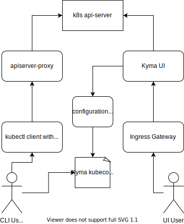

--> zmiana diagramu na flow chart

Kyma can be accessed in two different ways:
- Console User Interface: Simple webUI, which allows the user to view, create and manage their resources. 
- Kubernetes native CLI (kubectl): Kyma uses a custom proxy to handle all api-server connections, therefore one can distinguish two types of config files:
    + Cluster config file: Obtained directly from your cloud provider, allows direct access to the k8s api-server, usually as the admin user. This config is not kyma managed.
    + Kyma generated config file: Obtained from the webUI, this config uses the kyma api-server and predetermined user configuration (access and restrictions). 

--> po zmianie diagramu, opis usunąć podział A1-4, krótki słowny opis
## Console UI
The path for an user using the UI is presented in the diagram as path A, in which:
- A1: The user starts by accessing the UI though a browser, which is exposed using the *Ingress Gateway* component. This component redirects all traffic to TLS, performs TLS termination and connects the user with he desired service.
- A2: The user is welcomed by the Kyma Console, which serves a login page. If the Console application doesn't find a JWT token in the browser session storage, it redirects the user's browser to the Open ID Connect (OIDC) provider, Dex. 
- A3, A4: Dex lists all defined Identity Provider connectors to the user. The user selects the Identity Provider to authenticate with. After successful authentication, the browser is redirected back to the OIDC provider which issues a JWT token to the user. After obtaining the token, the browser is redirected back to the Console UI. The Console UI stores the token in the Session Storage and uses it for all subsequent requests.
- A5, A6: An option in the Console is to generate and download a user specific kubeconfig file. This file uses the currents users token to generate a valid yaml file, which is then downloaded. This file can be then user to access the cluster with the kubectl cli

Additionally, the Console is permission-aware, meaning it will only show the element, to which the logged user has access. The access is RBAC based.

>**TIP:** To read more about the console, please visit [this page](components/console/#overview-overview)

## CLI access with kubectl
The path for an user using the CLI is presented in the diagram as path B, in which:
- B1: Assuming the user has downloaded a kubeconfig file, he can then activate it by exporting it (`export KUBECONFIG=path/to/my/config.yaml`)
- B2, B3: All traffic to the k8s api-server goes though the kyma apiserver-proxy component, which verifies the token and permissions. The proxy queries the api-server verifying if he has the required access to a given resource before making the call for the resource itself. 
- B4: If there exists a proper RBAC rule and binding for the user, the query is then redirected to the k8s api-server

