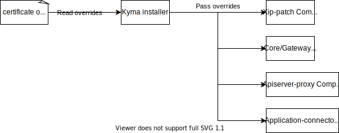

## Ingress
Kyma uses the [Istio Ingress Gateway](https://istio.io/latest/docs/reference/config/networking/gateway/) in order to handle all incoming traffic, manage TLS termination or handle mTLS communication between the cluster and external services. By default a `kyma-gateway` is configured as the main point of entry, which exposes all applications using the supplied domain and certificate.
Exposing applications is done using the [API Gateway](components/api-gateway/#overview-overview) controller. 

The current setup of the main gateway can be found [here](https://github.com/kyma-project/kyma/blob/master/resources/core/charts/gateway/templates/gateway.yaml). Configuration description:
- The gateway listens on port `80` and `443`
- Port `80` is automatically redirected to `443`
- The TLS connection requires at least `TLSV1_2`, meaning `TLSV1_0` and `TLSV1_1` is rejected
- Accepted cipher suites: `ECDHE-RSA-CHACHA20-POLY1305`, `ECDHE-RSA-AES256-GCM-SHA384`, `ECDHE-RSA-AES256-SHA`, `ECDHE-RSA-AES128-GCM-SHA256`, `ECDHE-RSA-AES128-SHA`

## TLS Managmenet
Kyma works on the basis of a bring your own domain/certificates model, meaning we expect the user to supply the certificate and key during installation. This can be achieved using the installation overrides, for example by creating the following configmap before the installation. This value is then propagated in the cluster for all component that require it.

```yaml
---
apiVersion: v1
kind: ConfigMap
metadata:
  name: my-certificate-overrides
  namespace: kyma-installer
  labels:
    installer: overrides
    kyma-project.io/installation: ""
data:
  global.tlsCrt: "CERT"
  global.tlsKey: "CERT_KEY"
```

>**TIP:** To learn more about how to use overrides in Kyma, see the following documents:
>* [Helm overrides for Kyma installation](/root/kyma/#configuration-helm-overrides-for-kyma-installation)
>* [Top-level charts overrides](/root/kyma/#configuration-helm-overrides-for-kyma-installation-top-level-charts-overrides)

However, if this is not supplied, then a demo setup is assumed using the DNS-as-a-Service provider [xip.io](http://xip.io/), and a self-signed certificate.

### Gardener
Kyma can also be installed on top of [Gardener](https://gardener.cloud/) managed instances, in which the existing certificate management service is used. In this case the user is not required to provide any certificates or domain, as they will be created for them by Gardener. The certificate is provided in the form a CustomResource managed by Gardener, and is a Wildcard certificate for the whole domain.

### Apiserver-proxy
The apiserver-proxy component is a Reverse Authorization proxy which acts as an intermediary with the Kubernetes API. By default it is exposed as a LoadBalancer Service, meaning it requires a dedicated certificate and DNS entry.

To learn about the component, please visit the [component page](https://github.com/kyma-project/kyma/tree/master/components/apiserver-proxy), and to learn about its configuration, please visit the [configuration section](/components/security-v2/#configuration-api-server-proxy-chart)

### Certificate propagation paths
As the certificate data is propagated though Kyma it is delivered into several components, which generate a set of Secrets/ConfigMaps. The propagation path varies slightly for each of the supported modes:



<div tabs name="certificate-propagation" group="tls-management">
  <details>
  <summary label="own-certificate">
  Bring your own Certificate
  </summary>
  | Kind | Name | Namespace |
  | :--- | :--- | :--- | 
  | Secret | ingress-tls-cert | kyma-system |
  | ConfigMap | net-global-overrides | kyma-installer | 
  | Secret | kyma-gateway-certs | istio-system |
  | Secret | kyma-gateway-certs-cacert | istio-system |
  | Secret | apiserver-proxy-tls-cert | kyma-system | 
  | ConfigMap | apiserver-proxy | kyma-system |  
  </details>
  <details>
  <summary label="demo-xip">
  Demo xip.io setup
  </summary>
  | Kind | Name | Namespace |
  | :--- | :--- | :--- | 
  | Secret | ingress-tls-cert | kyma-system |
  | ConfigMap | net-global-overrides | kyma-installer | 
  | Secret | kyma-gateway-certs | istio-system |
  | Secret | kyma-gateway-certs-cacert | istio-system |
  | Secret | apiserver-proxy-tls-cert | kyma-system | 
  | ConfigMap | apiserver-proxy | kyma-system |
  </details>
  <details>
  <summary label="gardener">
  Gardener managed
  </summary>
  | Kind | Name | Namespace |
  | :--- | :--- | :--- | 
  | Secret | ingress-tls-cert | kyma-system |
  | ConfigMap | net-global-overrides | kyma-installer | 
  | Secret | kyma-gateway-certs-cacert | istio-system |
  | Certificate | kyma-tls-cert | istio-system
  | Certificate | apiserver-proxy-tls-cert | kyma-system | 
  | ConfigMap | apiserver-proxy | kyma-system |
   </details>
</div>

## Egress
Currently no Egress limitations are implemented, meaning that all applications deployed in the Kyma cluster can access outside resources without limitations.
However, a future improvement is to enable [Istio Egress Gateway](https://istio.io/latest/docs/tasks/traffic-management/egress/egress-gateway/), which can limit the number of external services accessible to the applications running within the cluster.

>**NOTE:** in the case of connection problems with external services it may be required to create an [Service Entry](https://istio.io/latest/docs/reference/config/networking/service-entry/) object to register the service. 

