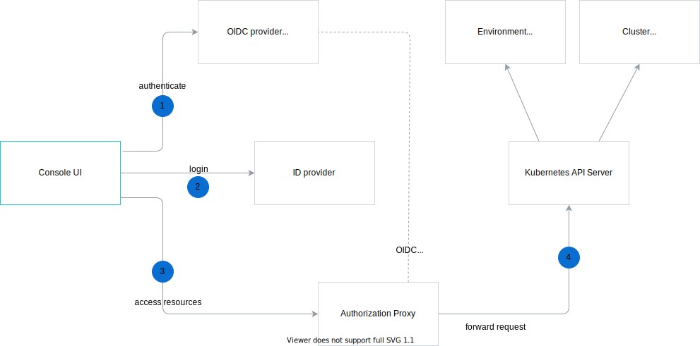

The following diagram illustrates the authorization and authentication flow in Kyma. The representation assumes the Kyma Console UI as the user's point of entry.

1. The user opens the Kyma Console UI. If the Console application doesn't find a JWT token in the browser session storage, it redirects the user's browser to the Open ID Connect (OIDC) provider, Dex.
2. Dex lists all defined Identity Provider connectors to the user. The user selects the Identity Provider to authenticate with. After successful authentication, the browser is redirected back to the OIDC provider which issues a JWT token to the user. After obtaining the token, the browser is redirected back to the Console UI. The Console UI stores the token in the Session Storage and uses it for all subsequent requests.
3. The Authorization Proxy validates the JWT token passed in the **Authorization Bearer** request header. It extracts the user and groups details from the token, and set the required impersonate headers.
4. The request is forwarded to the Kubernetes API Server.  

>**NOTE:** The Authorization Proxy can verify JWT tokens issued by Dex because Dex is registered as a trusted issuer through OIDC parameters during the Kyma installation.  
