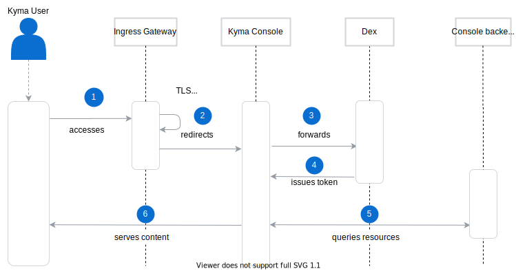
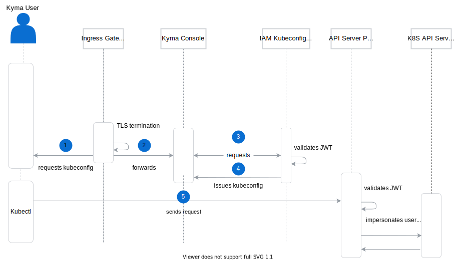

As a user, you can access Kyma using the following:

- [Kyma Console](components/console/#overview-overview) which allows you to view, create, and manage your resources. 
- [Kubernetes-native CLI (kubectl)](https://kubernetes.io/docs/reference/kubectl/overview/), which you can also use to manage your resources using a command-line interface. Kyma uses a custom [API Server Proxy component](https://github.com/kyma-project/kyma/blob/master/components/apiserver-proxy/README.md) to handle all connections between the user and the Kubernetes API server. To access and manage your resources, you need a config file which includes the JWT token required for authentication. You have two options:

    * Cluster config file you can obtain directly from your cloud provider. It allows you to directly access the Kubernetes API server, usually as the admin user. Kyma does not manage this config in any way.
    * Kyma-generated config file you can download using the Kyma Console. This config uses the Kyma `api-server` proxy to access the Kubernetes API server and predefined user configuration to manage access and restrictions. 

## Console UI

The diagram shows the Kyma access flow using the Console UI.



>**NOTE:** The Console is permission-aware so it only shows elements to which you have access as a logged-in user. The access is RBAC-based.

1. Access the Kyma Console UI exposed by the [Istio Ingress Gateway](components/application-connector/#architecture-application-connector-components-istio-ingress-gateway) component. 
2. Under the hood, the Ingress Gateway component redirects all traffic to TLS, performs TLS termination to decrypt the incoming data, and forwards you to the Kyma Console.
3. If the Kyma Console does not find a JWT token in the browser session storage, it redirects you to Dex, the Open ID Connect (OIDC) provider. Dex lists all defined identity provider connectors, so you can select one to authenticate with.
4. After successful authentication, Dex issues a JWT token for you. The token is stored in the browser session so it can be used for further interaction.
5. When you interact with the Console, the UI queries the backend implementation and comes back to you with the response.

## kubectl

To manage the connected cluster using the kubectl Command Line Interface (CLI), you first need to generate and download the `kubeconfig` file that allows you to access the cluster within your permission boundaries.



1. Use the Console UI to [request the IAM Kubeconfig Service to generate the `kubeconfig` file](#tutorials-get-the-kubeconfig-file). 
2. Under the hood, the Ingress Gateway performs TLS termination to decrypt the incoming data and allows the Kyma Console to proceed with the request.
3. The request goes out from the Kyma Console to the IAM Kubeconfig Service.
4. IAM Kubeconfig Service validates your in-session ID token and rewrites it into the generated `kubeconfig` file.
  
  >**NOTE:** The time to live (TTL) of the ID token is 8 hours, which effectively means that the TTL of the generated `kubeconfig` file is 8 hours as well. 
  The content of the file looks as follows:

    ```yaml
    apiVersion: v1
    clusters:
    - cluster:
        certificate-authority-data: SERVER_CERTIFICATE_REDACTED
        server: https://apiserver.kyma.local:9443
      name: kyma.local
    contexts:
    - context:
        cluster: kyma.local
        user: OIDCUser
      name: kyma.local
    current-context: kyma.local
    kind: Config
    preferences: {}
    users:
    - name: OIDCUser
      user:
        token: TOKEN_REDACTED
    ```

5. Use your terminal to run a command, for example to get a list of resources.
6. Since the Kubernetes API server is not exposed directly, your request goes to the API Server Proxy service. It validates the incoming JWT token and forwards requests to the Kubernetes API server.
