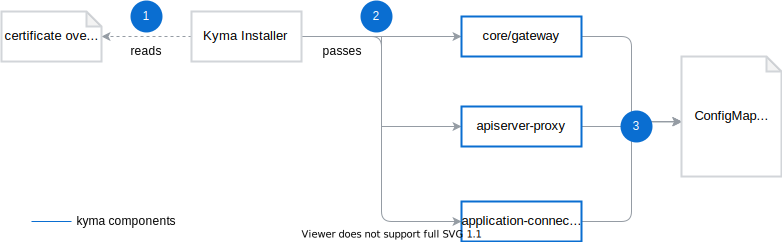

## Ingress

Kyma uses the [Istio Ingress Gateway](https://istio.io/latest/docs/reference/config/networking/gateway/) to handle all incoming traffic, manage TLS termination, and handle mTLS communication between the cluster and external services. By default, the [`kyma-gateway`](https://github.com/kyma-project/kyma/blob/main/resources/core/charts/gateway/templates/gateway.yaml) configuration defines the points of entry to expose all applications using the supplied domain and certificates.
Applications are exposed using the [API Gateway](components/api-gateway/#overview-overview) controller.

The configuration specifies the following parameters and their values:

| Parameter | Description | Value|
|-----| ---| -----|
| **spec.servers.port** | The ports gateway listens on.  Port `80` is automatically redirected to `443`.| `443`, `80`.|
| **spec.servers.tls.minProtocolVersion** | The minimum protocol version required by the TLS connection. | `TLSV1_2` protocol version. `TLSV1_0` and `TLSV1_1` are rejected. |
| **spec.servers.tls.cipherSuites** | Accepted cypher suites. | `ECDHE-RSA-CHACHA20-POLY1305`, `ECDHE-RSA-AES256-GCM-SHA384`, `ECDHE-RSA-AES256-SHA`, `ECDHE-RSA-AES128-GCM-SHA256`, `ECDHE-RSA-AES128-SHA`|

## TLS management

Kyma employs the Bring Your Own Domain/Certificates model that requires you to supply the certificate and key during installation. You can do it using the [Helm overrides for Kyma installation](/root/kyma/#configuration-helm-overrides-for-kyma-installation). See a sample ConfigMap specifying the values to override:

```yaml
---
apiVersion: v1
kind: ConfigMap
metadata:
  name: my-certificate-overrides
  namespace: kyma-installer
  labels:
    installer: overrides
    kyma-project.io/installation: ""
data:
  global.tlsCrt: "CERT"
  global.tlsKey: "CERT_KEY"
```
During installation, the values are [propagated in the cluster](#certificate-propagation-paths) to all components that require them.

### Demo setup with xip.io

If you don't supply any certificates or domain during installation, the kyma-installer will default to a demo setup using the [xip.io](http://xip.io/) DNS-as-a-Service (DNSaaS) provider. In this case the domain is generated on demand using the clusters LoadBalancer IP in the form of `*.LoadBalancerIP.xip.io` along with a self-signed certificate for the domain.

>**NOTE:** Due to limited availability of the DNSaaS provider and a self-singed certificate which can be rejected by some browsers and applications, this setup is regarded as a working, visual demo. Do not use it for other scenarios.

### Gardener

You can install Kyma on top of [Gardener](https://gardener.cloud/) managed instances which use the already present certificate management service. Because Gardener creates the certificates or domain, you don't have to provide them. The certificate is a Custom Resource managed by Gardener, and is a wildcard certificate for the whole domain.

### API Server Proxy

The [API Server Proxy](https://github.com/kyma-project/kyma/tree/main/components/apiserver-proxy) component is a reverse proxy which acts as an intermediary for the Kubernetes API. By default, it is exposed as a LoadBalancer Service, meaning it requires a dedicated certificate and DNS entry.

To learn more about about API Server Proxy configuration, see the [configuration section](/components/security/#configuration-api-server-proxy-chart).

### Certificate propagation paths

The certificate data is propagated though Kyma and delivered to several components.



1. Kyma Installer reads the override files you have configured.
2. Kyma installer passes the values to the specific Kyma components.
3. Each of these components generates Secrets, ConfigMaps, and Certificates in a certain order.

The table shows the order in which the configuration elements are created.

>**NOTE:** The table does not include all possible dependencies between the components and elements that use the certificates. It serves as a reference to know where to find information about the certificates and configurations.

The order differs depending on the mode:

<div tabs name="certificate-propagation" group="tls-management">
  <details>
  <summary label="own-certificate">
  Bring Your Own Certificate
  </summary>
  | **Kind** | **Name** | **Namespace** |
  | :--- | :--- | :--- |
  | Secret | ingress-tls-cert | `kyma-system` |
  | ConfigMap | net-global-overrides | `kyma-installer `|
  | Secret | kyma-gateway-certs | `istio-system` |
  | Secret | app-connector-certs | `istio-system `|
  | Secret | apiserver-proxy-tls-cert | `kyma-system` |
  | ConfigMap | apiserver-proxy | `kyma-system `|  
  </details>
  <details>
  <summary label="demo-xip">
  Demo xip.io setup
  </summary>
  | **Kind** | **Name** | **Namespace** |
  | :--- | :--- | :--- |
  | Secret | ingress-tls-cert | `kyma-system` |
  | ConfigMap | net-global-overrides | `kyma-installer `|
  | Secret | kyma-gateway-certs | `istio-system` |
  | Secret | app-connector-certs | `istio-system `|
  | Secret | apiserver-proxy-tls-cert | `kyma-system` |
  | ConfigMap | apiserver-proxy | `kyma-system `|  
  </details>
  <details>
  <summary label="gardener">
  Gardener-managed
  </summary>
  | **Kind** | **Name** | **Namespace** |
  | :--- | :--- | :--- |
  | Secret | ingress-tls-cert | `kyma-system `|
  | ConfigMap | net-global-overrides | `kyma-installer `|
  | Secret | app-connector-certs | `istio-system` |
  | Certificate | kyma-tls-cert | `istio-system`|
  | Certificate | apiserver-proxy-tls-cert | `kyma-system` |
  |ConfigMap | apiserver-proxy | `kyma-system` |
   </details>
</div>

## Egress
Currently no Egress limitations are implemented, meaning that all applications deployed in the Kyma cluster can access outside resources without limitations.

>**NOTE:** in the case of connection problems with external services it may be required to create an [Service Entry](https://istio.io/latest/docs/reference/config/networking/service-entry/) object to register the service.
