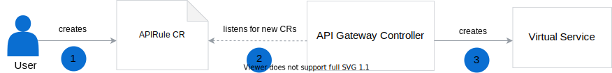

By default, functions in Kyma are not exposed outside the cluster. The Knative Serving Controller normally creates two virtual services, one for the internal cluster communication and the other one for exposing the function outside the cluster. To restrict the access, the Function Controller automatically sets the default `serving.knative.dev/visibility=cluster-local` label on a KService CR that is added to its metadata when a Function CR is processed. This limits the Knative Serving Controller to create only one, local virtual service that allows only for cluster-wide access to function services. Other resources can access such a function within the cluster under the `{service-name}.{namespace}.svc.cluster.local` endpoint, such as `test-function.default.svc.cluster.local`.

> **TIP:** For more details on cluster-local services in Knative, read [this](https://knative.dev/docs/serving/cluster-local-route/) document.

To expose a function outside the cluster, you must create an [APIRule custom resource (CR)](/components/api-gateway-v2#custom-resource-api-rule):

1. Create the APIRule CR where you specify the function to expose, define a [Oathkeeper Access Rule](/components/api-gateway-v2/#details-available-security-options) to secure it, and list which HTTP request methods you want to enable for it.

2. The API Gateway Controller detects a new APIRule CR and reads its definition.

3. The API Gateway Controller creates an Istio Virtual Service and Access Rules according to details specified in the CR. Such a function service is available under the `{host-name}.{domain}` endpoint, such as `my-function.kyma.local`.

This way you can specify multiple API Rules with different authentication methods for a single function service.

> **TIP:** See [this](#tutorials-expose-a-function-with-an-api-rule) tutorial for a detailed example.
