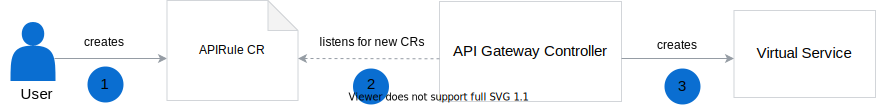

By default, lambdas in Kyma are not exposed outside the cluster. To restrict the access, we set automatically the default `serving.knative.dev/visibility=cluster-local` label on KSevice CR, when Function CR is reconciled. Without this label, the Knative Serving controller would create two virtual services, one for the internal cluster communication and the other one for exposing the lambda service outside the cluster. `serving.knative.dev/visibility=cluster-local` label on KSevice CR limits the Knative Serving controller to create only one, local virtual service that allows only for cluster-wide access to lambda services. Such a lambda is accessible for other resources within the cluster under the `{service-name}.{namespace}.svc.cluster.local` endpoint, such as `test-lambda.default.svc.cluster.local`.

> **TIP:** For more details on cluster-local services in Knative, read [this](https://knative.dev/docs/serving/cluster-local-route/) document.

To expose a lambda outside the cluster, you must create an [APIRule custom resource (CR)](/components/api-gateway-v2#custom-resource-api-rule):

1. Create the APIRule CR where you specify the lambda to expose, define a [Oathkeeper Access Rule](/components/api-gateway-v2/#details-available-security-options) to secure it, and list which HTTP request methods you want to enable for it.

2. The API Gateway Controller detects a new APIRule CR and reads its definition.

3. The API Gateway Controller creates an Istio Virtual Service and Access Rules according to details specified in the CR. Such a lambda service is available under the `{host-name}.{domain}` endpoint, such as `my-lambda.kyma.local`.

This way you can specify multiple API Rules with different authentication methods for a single lambda service.

> **TIP:** See [this](#tutorials-expose-a-lambda-with-an-api-rule) tutorial for a detailed example.
