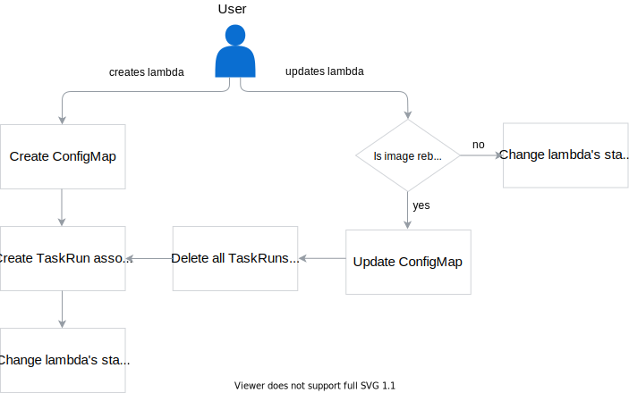
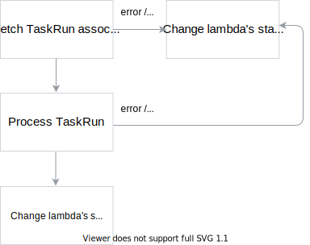
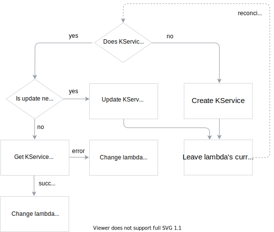

From the moment you create or update a lambda (Function CR) till the time it reaches the final, `Running` status phase, lambda goes through three processing stages:

1. `Initializing`
2. `Building`
3. `Deploying`

The diagrams illustrate these three core phases of a lambda processing circle handled by the Function Controller. They also list all custom resources and configuration changes involved in this process.

>**NOTE:** For the detailed description of its all lambda status phases, its substages, and reasons, see also the [this](#custom-resource-function-status-reasons) document.

## Initializing

This initial phase starts with creating or updating a Function CR with the ConfigMap specifying its configuration setup. It ends with creating a TaskRun for the lambda image built. Importantly, when you only update lambda's environmental variables, this change does not require image rebuilt but only affects KService in further phases. Also, the logic of the Function Controller requires deleting all previous TaskRun CRs for the given lambda's **FunctionUID**, each time you update lambda's configuration.

## Building

This phase involves fetching and processing the TaskRun CR.
It ends successfully when the lambda image is built and sent to the Docker registry. If the image already existed and  only update was required, the the Docker image receives a new tag.

## Deploying

This stage evolves around creating a KService or updating it when you previously changed environment variables in the Function CR. In general, KService is considered updated when both environment variables and the image tag in the KService are up to date.

