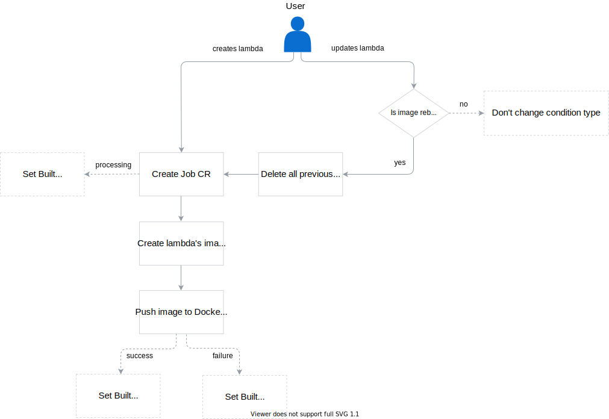
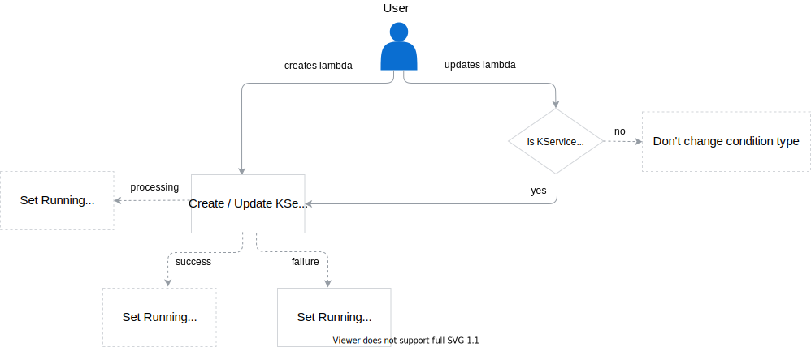

From the moment you create a lambda (Function CR) until the time it is ready, it goes through three processing stages that are defined as these condition types:

1. `ConfigurationReady` (PrinterColumn `CONFIGURED`)
2. `BuildReady` (PrinterColumn `BUILT`)
3. `Running` (PrinterColumn `RUNNING`)

For a lambda to be considered ready, the status of all three conditions must be `True`:  

```bash
NAME                        CONFIGURED   BUILT   RUNNING   VERSION   AGE
test-lambda                 True         True    True      1         18m
```

When you update an existing lambda, conditions change asynchronously depending on the change type.  

The diagrams illustrate all three core status changes in the lambda processing circle that the Function Controller handles. They also list all custom resources involved in this process and specify in which cases their update is required.

>**NOTE:** Before you start reading, see the [Function CR](#custom-resource-function) document for the custom resource detailed definition, the list of all lambda's condition types and reasons for their success or failure.

## Configured

This initial phase starts when you create a Function CR with configuration specifying the lambda's setup. It ends with creating a ConfigMap that is used as a building block for a lambda image.


## Built

This phase involves creating and processing the Job CR. It ends successfully when the lambda image is built and sent to the Docker registry. If the image already existed and only an update is required, the Docker image receives a new tag.

Updating an existing lambda requires an image rebuild only if you change the lambda's body (**source**) or dependencies (**deps**). An update of lambda's other configuration details, such as environment variables, replicas, resources, etc, or labels, does not require image rebuild, and it only affects KService.

> **NOTE:** Each time you update lambda's configuration, the Function Controller deletes all previous Job CRs for the given lambda's **UID**.



## Running

This stage revolves around creating a KService or updating it when configuration changes were made in the Function CR or the lambda image was rebuilt. In general, the KService is considered updated when both configuration and the image tag in the KService are up to date. Thanks to the implemented reconciliation loop, the Function Controller constantly observes all newly created or updated KServices. If it detects one, it fetches the KService status and only then updates the lambda's status.


