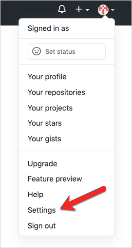
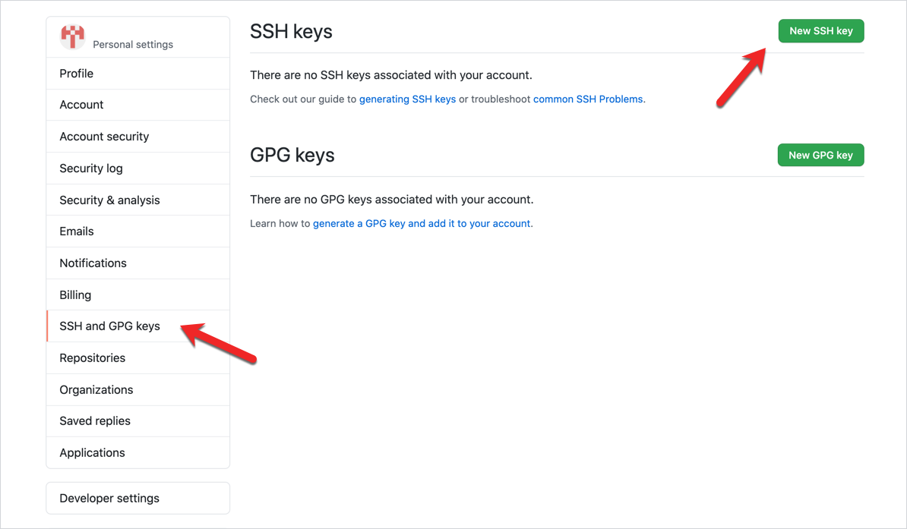
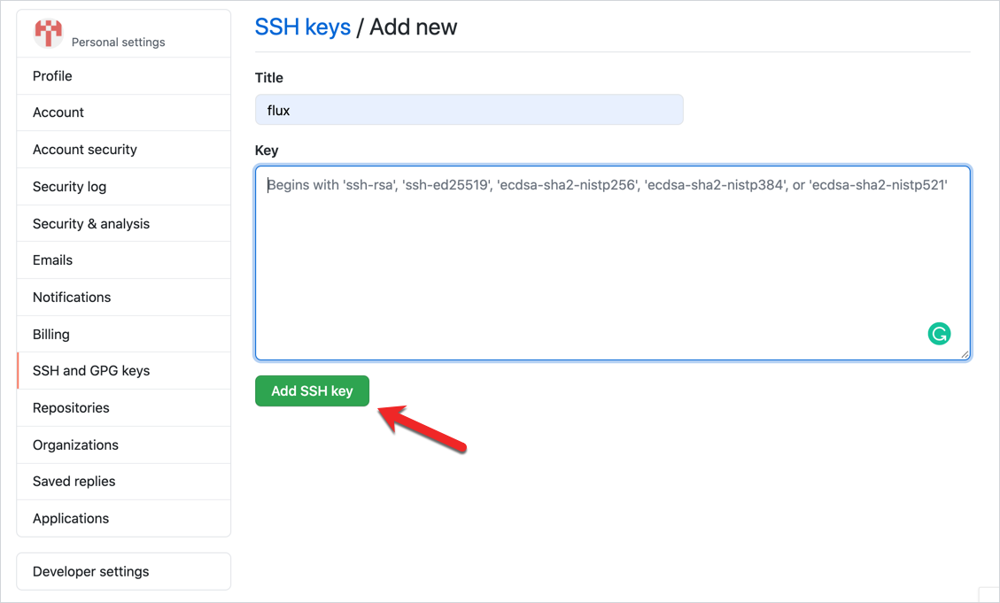

This tutorial shows how you can automate the deployment of the local resources on a cluster using the GitOps logic. You will use Kyma CLI to create an inline Function with a trigger. You will push both to a GitHub repository and sync the changes from the Git repository to a cluster using a GitOps operator. For the purpose of this tutorial, you will install and use the [Flux](https://docs.fluxcd.io/en/1.17.1/tutorials/get-started.html) GitOps operator and a lightweight [k3d](https://k3d.io/) cluster.

## Prerequisites

All you need before you start is to have the following:

- CLI
- brew
- Git repository

## Steps

These sections will lead you through the whole process. You will first install k3d and create a cluster for your custom resources (CRs). Then, you will need to apply the necessary Custom Resource Definitions (CRDs) from Kyma to be able to create Functions and triggers. Finally, you will install Flux and authorize it with the `write` access to your GitHub repository in which you store the resource files. Flux will automatically synchronize any new changes in your repository with your k3d cluster.

## Install and configure a k3d cluster

1. Install k3d using brew:

```bash
brew install k3d
```

2. Cluster a default k3d cluster with a single server node:

```bash
k3d cluster create {CLUSTER-NAME}
```

This command also sets your context to the newly created cluster. Run this command to display the cluster information:

```bash
kubectl cluster-info
```

3. Apply the Kyma's `functions.serverless.kyma-project.io` and `triggers.eventing.knative.dev` CRDs from the sources in the [`kyma`](https://github.com/kyma-project/kyma/tree/master/resources/cluster-essentials/files) repository. You will need them to create the Function and Trigger CRs on the cluster.

```bash
kubectl apply -f https://raw.githubusercontent.com/kyma-project/kyma/master/resources/cluster-essentials/files/functions.serverless.crd.yaml && kubectl apply -f https://raw.githubusercontent.com/kyma-project/kyma/master/resources/cluster-essentials/files/triggers.eventing.knative.dev.crd.yaml
```
4. Run this command to make sure the CRs were applied:

```bash
kubectl get customresourcedefinitions
```

## Prepare your local workspace

1. Create a workspace folder in which you will create source files for your Function:

```bash
mkdir {WORKSPACE_FOLDER}
```

2. Use the `init` Kyma CLI command to create a local workspace with default configuration for a Python Function:

```bash
kyma init function --runtime python38 --dir $PWD/{WORKSPACE_FOLDER}
```

This command will download the following files to your workspace folder:

- `config.yaml`	with the Function's configuration
- `handler.py` with the Function's code and the simple "Hello World" logic
- `requirements.txt` with an empty file for your Function's custom dependencies

It will also set **sourcePath** in the `config.yaml` file to the full path of the workspace folder:

```yaml
name: my-function
namespace: default
runtime: python38
source:
    sourceType: inline
    sourcePath: {FULL_PATH_TO_WORKSPACE_FOLDER}
```

## Install and configure Flux

You can now install the Flux operator, connect it with a specific Git repository, and authorize Flux to automatically pull changes from the repository and apply them on your cluster.

1. Install flux:

```bash
brew install fluxctl
```

2. Create a `flux` Namespace for the Flux operator's CRDs.

```bash
kubectl create namespace flux
```

3. Export details of your GitHub repository - its name, account name and related e-mail address, and the folder to which you will push Function and Trigger CRs built from local sources. Flux will synchronize the cluster with the content of this folder.

```bash
export GH_USER="{USERNAME}"
export GH_REPO="{REPOSITORY_NAME}"
export GH_EMAIL="{EMAIL_OF_YOUR_GH_ACCOUNT}"
export GH_FOLDER="{GH_FOLDER_FOR_FUNCTION_RESOURCES}"
```

4. Run this command apply CRDs of the Flux operator in the `flux` Namespace on your cluster.

```bash
fluxctl install \
--git-user=${GH_USER} \
--git-email=${GH_EMAIL} \
--git-url=git@github.com:${GH_USER}/${GH_REPO}.git \
--git-path=${GH_FOLDER} \
--namespace=flux | kubectl apply -f -
```

You will see that Flux created these CRDs:

```bash
serviceaccount/flux created
clusterrole.rbac.authorization.k8s.io/flux created
clusterrolebinding.rbac.authorization.k8s.io/flux created
deployment.apps/flux created
secret/flux-git-deploy created
deployment.apps/memcached created
service/memcached created
```

5. Obtain the certificate (SSH key) that Flux generated:

```bash
fluxctl identity --k8s-fwd-ns flux
```

6. Run this command to copy the SSH key to the clipboard:

```bash
fluxctl identity --k8s-fwd-ns flux | pbcopy
```

7. Go to your GitHub account **Settings**:



8. Go to the **SSH and GPG keys** section and select the **New SSH key** button.



9. Provide the new key name, paste the previously copied SSH key, and confirm changes by selecting the **Add SSH Key** button.



## Create resources

You will now create a sample Function and modify it by adding a trigger to it.

### Create a Function

Now that Flux is authenticated to pull changes from your Git repository, you can start creating CRs from your local workspace files.

1. Back in the terminal, clone this GitHub repository to your current workspace location:

```bash
git clone git@github.com:${GH_USER}/${GH_REPO}.git
```

2. Go to the repository folder:

```bash
cd {LOCAL_GITHUB_REPOSITORY_FOLDER}
```

3. Run the `apply` Kyma CLI command to create a Function CR in the YAML format on your remote GitHub repository. This command will generate the output in the `my-function.yaml` file.

```bash
kyma apply function --filename {FULL_PATH_TO_LOCAL_WORKSPACE_FOLDER}/config.yaml --output yaml --dry-run > ./{GH_REPO}/${GH_FOLDER}/my-function.yaml
```

4. Push the local changes to the remote repository:

```bash
git add .  # Stage changes for the commit
git commit -m 'Add my-function' # Add a commit message
git push origin main # Push the changes to the "main" branch of your Git repository
```

5. Go to the GitHub repository and see that the changes were pushed.

6. By default, Flux pulls CRs from the Git repository and pushes them to the cluster in 5-minute intervals. To enforce immediate synchronization, run this command from the terminal:

```bash
fluxctl sync --k8s-fwd-ns flux
```

7. Make sure that the Function CR was applied by Flux to the cluster:

```bash
kubectl get functions
```

## Create a Trigger

1. From your workspace folder, modify the local `config.yaml` file by adding a trigger details (**triggers**) to your Function as follows:

```yaml
name: my-function
namespace: default
runtime: python38
source:
    sourceType: inline
    sourcePath: {FULL_PATH_TO_WORKSPACE_FOLDER}
triggers:
- eventTypeVersion: evt1
  source: the-source
  type: t1
```

2. Create the Function resource from local sources and place the output it your Git repository folder:

```bash
kyma apply function --filename {FULL_PATH_TO_LOCAL_WORKSPACE_FOLDER}/config.yaml --output yaml --dry-run > ./{GH_REPO}/${GH_FOLDER}/my-function.yaml
```

3. Push the local changes to the remote repository:

```bash
git add .
git commit -m 'Update my-function'
git push origin main
```

4. Go to the GitHub repository and see that the `my-function.yaml` file was modified as intended.

5. From the terminal, force Flux to immediately propagate the Git repository changes to the cluster:

```bash
fluxctl sync --k8s-fwd-ns flux
```

6. Check that the new Trigger CR for the Function was created:

```bash
kubectl get triggers
```

You can see that Flux synchronized the resources and the new Trigger CR for the Function was added to your cluster.

## Reverting feature

Once you set it up, Flux will keep monitoring the given Git repository folder for any changes. If you modify the existing resources directly on the cluster, Flux will automatically revert these changes and update the given resource back its version on the `main` branch of the Git repository.  
