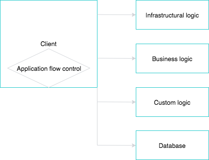
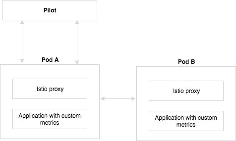
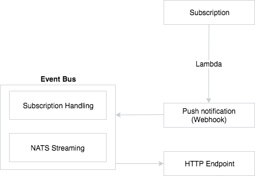

## Overview

The term "serverless" refers to an architecture that is Internet-based. Application development that uses serverless technology relies solely on a combination of cloud-based, third-party services, client-side logic, and service-hosted remote procedure calls, also known as "Functions as a Service" or FaaS. Developers use lambdas to create this combination. As a result, this combination replaces the common use of a server. In the context of Kyma, lambda functions connect third-party services and Kyma. Developing with this serverless approach reduces the implementation and operation effort of an application to the absolute minimum.

## The Serverless architecture

The following diagram illustrates a generic serverless implementation.

The application flow takes place on the client side. Third parties handle the infrastructural logic. Custom logic can process updates and encapsulate databases. Authentication is an example of custom logic. Third parties can also handle business logic. A hosted database contains read-only data that the client reads. None of this functionality runs on a single, central server. Instead, the client relies on FaaS as its resource.

The following diagram shows an example of tasks that lambdas can perform in Kyma after a user invokes them.

First, the user invokes the exposed lambda endpoint. Then, the lambda function can carry out a number of tasks, such as:

* Retrieving cart information from Enterprise Commerce
* Retrieving stock details
* Updating a database

## Open source components

Kyma is comprised of several open source technologies to provide extensive functionality.

### Kubeless

Kubeless is the serverless framework integrated into Kyma that allows you to deploy lambda functions. These functions run in Pods inside the Kubeless controller on a node, which can be a virtual or hardware machine.

Kubeless also has a command line interface. Use Node.js to create lambda functions.

### Istio

Istio is a third-party component that makes it possible to expose and consume services in Kyma. See the [Istio documentation](https://istio.io) to learn more. Istio helps create a network of deployed services, called a service mesh.

In Kyma, functions run in Pods. Istio provides a proxy for specified pods that talk to a pilot. The pilot confirms whether access to the pod is permissible as per the request. In the diagram, Pod B requests access to Pod A. Pod A has an Istio proxy that contains a set of instructions on which services can access Pod A. The Istio proxy also notifies Pod A as to whether Pod B is a part of the service mesh. The Istio Proxy gets all of its information from the Pilot.

### NATS

The Event Bus in Kyma monitors business events and trigger functions based on those events. At the heart of the Event Bus is NATS, an open source, stand-alone messaging system. To learn more about NATS, visit the [NATS website](https://nats.io).

The following diagram demonstrates the Event Bus architecture.

The Event Bus exposes an HTTP endpoint that the system can consume. An external event, such as a subscription, triggers the Event Bus. A lambda function works with a push notification, and the subscription handling of the Event Bus processes the notification.
