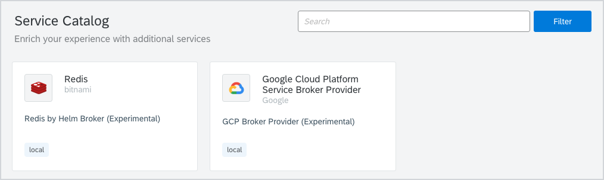
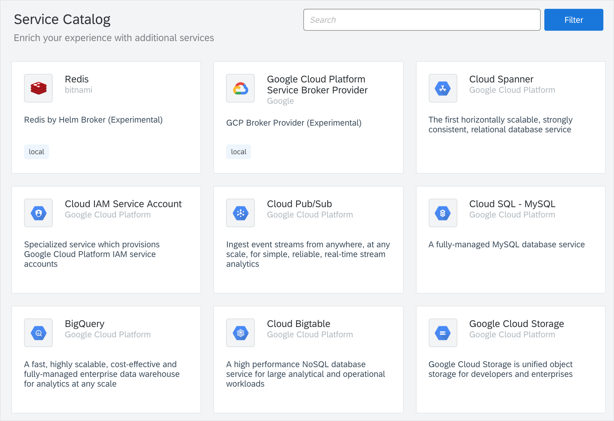

Google Cloud Platform (GCP) Service Broker is an implementation of the [Open Service Broker](https://www.openservicebrokerapi.org/) (OSB) API hosted on GCP. It simplifies the delivery of GCP services to applications that run on Kyma. By creating GCP resources and managing their corresponding permissions, Service Broker makes it easy to consume GCP services from within a Kubernetes cluster.

Kyma provides Namespace-scoped GCP Service Broker. In each Namespace, you can configure the GCP Broker against different Google Cloud Platforms. Install the GCP Service Broker by provisioning the `Google Cloud Platform Service Broker Provider` class provided by the Helm Broker. 

Once you provision the `Google Cloud Platform Service Broker Provider` class, the GCP Service Broker classes are available in the Service Catalog view in a given Namespace.

 
For more information, see the **Helm Broker** overview document and the description of the [Service Class](https://github.com/kyma-project/kyma/blob/master/docs/service-brokers/helm-broker-service-classes/gcp-broker-provider/docs/plans-details.md) which installs the GCP Service Broker.

>**NOTE:** Google does not provide the ability to specify the broker's version so the most up-to-date version of the GCP Broker is installed.
