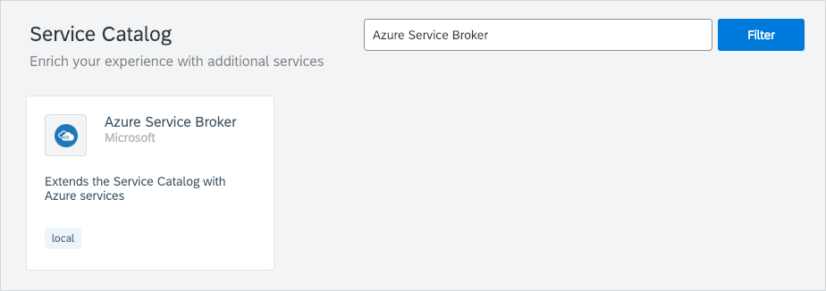

The Microsoft Azure Service Broker is an open source, [Open Service Broker](https://www.openservicebrokerapi.org/)-compatible API server that provisions managed services in the Microsoft Azure public cloud. The Azure Service Broker provides these Service Classes to use with the Service Catalog:
* Azure SQL Database
* Azure Database for MySQL
* Azure Redis Cache
* Azure Application Insights
* Azure CosmosDB
* Azure Event Hubs
* Azure IoT Hub
* Azure Key Vault
* Azure SQL Database
* Azure SQL Database Failover Group
* Azure Service Bus
* Azure Storage
* Azure Text Analytics

See the details of each Service Class and its specification in the Service Catalog UI.
For more information about the Service Brokers, see the Service Brokers **Overview** document.

>**NOTE:** Kyma uses the Microsoft Azure Service Broker open source project. To ensure the best performance and stability of the product, Kyma uses a version of the Azure Service Broker that precedes the newest version released by Microsoft.

Kyma provides Namespace-scoped Azure Service Broker. In each Namespace, you can configure the Azure Service Broker against different subscriptions. Install the Azure Service Broker by provisioning the **Azure Service Broker** class provided by the Helm Broker.

Once you provision the **Azure Service Broker** class, the Azure Service Broker classes are available in the Service Catalog view in a given Namespace.
