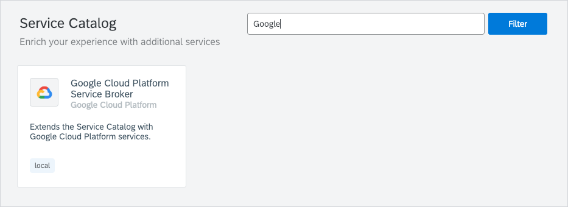
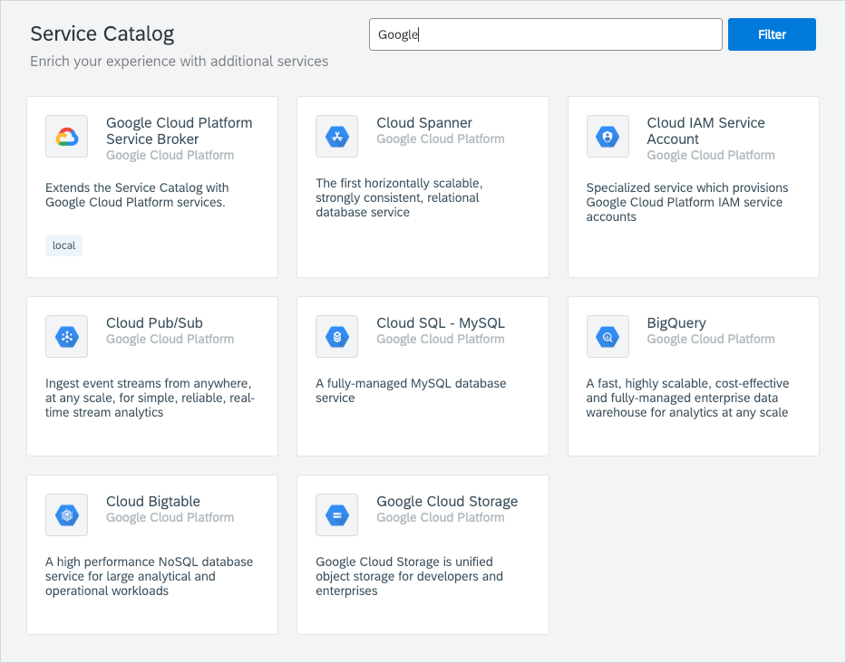

>**NOTE:** The Google Cloud Platform (GCP) Service Broker is in the experimental phase.

Google Cloud Platform (GCP) Service Broker is an implementation of the [Open Service Broker](https://www.openservicebrokerapi.org/) (OSB) API hosted on GCP. It simplifies the delivery of GCP services to applications that run on Kyma. By creating GCP resources and managing their corresponding permissions, Service Broker makes it easy to consume GCP services from within a Kubernetes cluster.

Kyma provides Namespace-scoped Google Cloud Platform Service Broker. In each Namespace, you can configure the Google Cloud Platform Broker against different Google Cloud Platforms. Install the Google Cloud Platform Service Broker by provisioning the **Google Cloud Platform Service Broker** class provided by the Helm Broker. 

Once you provision the **Google Cloud Platform Service Broker** class, the Google Cloud Platform Service Broker classes are available in the Service Catalog view in a given Namespace.

For more information about provisiong the **Google Cloud Platform Service Broker** class, go to the service class overview in the Service Catalog UI.
