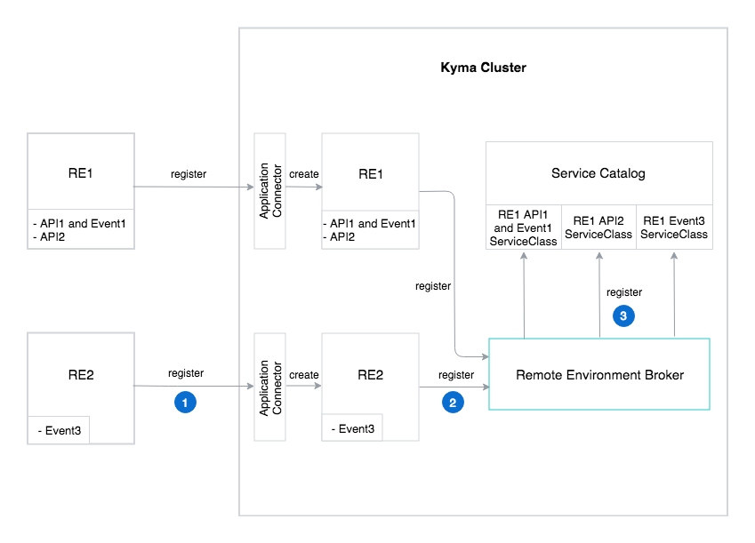
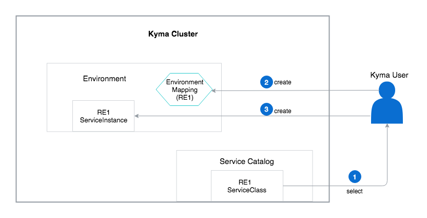

The Remote Environment Broker (REB) workflow starts with the registration process, during which a remote environment (RE) is registered on the Kyma cluster.

### Remote environment registration process

The registration process of the remote environment consists of the following steps:

1. Kyma administrator registers the remote environment's APIs and Events definitions to the Kyma cluster through the Application Connector which creates a remote environment custom resource inside the cluster.
2. The Remote Environment Broker observes and registers all the remote environment custom resources.
3. Whenever services (APIs and/or Events) appear in a given remote environment, the REB registers them as ServiceClasses in the Service Catalog.

### Enable the provisioning process

After the registration, trigger the provisioning of a given ServiceClass by creating a ServiceInstance. Before you create a ServiceInstance of a given ServiceClass, you must create the EnvironmentMapping. The EnvironmentMapping enables the remote environment offering in a given Environment. Creating a ServiceInstance without the EnvironmentMapping ends with failure. For more details about the EnvironmentMapping, see the **Examples** document.

Provisioning and binding work differently for API, Event, and both the API and Event ServiceClass. Because of that, these operations are described in separate sections. In relation to the nature of remote environment ServiceClasses, you can provision them just once in a given Environment.

### Provisioning and binding for an API ServiceClass

This ServiceClass has a **bindable** flag set to `true` which means that you have to provision a ServiceInstance and bind it to the service or lambda to connect to the given API. The provisioning and binding workflow for an API ServiceClass consists of the following steps:
1. Select a given API ServiceClass from the Service Catalog.
2. Provision this ServiceClass by creating its ServiceInstance in the given Environment.
3. Bind your ServiceInstance to the service or lambda. During the binding process, ServiceBinding and ServiceBindingUsage resources are created.
    * ServiceBinding contains a Secret with a GatewayURL needed to connect to the given API.
    * ServiceBindingUsage injects the Secret, together with the label given during the registration process, to the lambda or service.
4. The service or lambda calls the API through the Application Connector. The Application Connector verifies the label to check if you have the authorization to access this API.
5. After verifying the label, the Application Connector allows you to access the remote environment API.

### Provisioning and binding for an Event ServiceClass

This ServiceClass has a **bindable** flag set to `false` which means that after provisioning a ServiceClass in the Environment, given Events are ready to use for all services. The provisioning workflow for an Event ServiceClass consists of the following steps:
1. Select a given Event ServiceClass from the Service Catalog.
2. Provision this ServiceClass by creating a ServiceInstance in the given Environment.
3. During the provisioning process, the EventActivation resource is created together with the ServiceInstance. EventActivation allows you to create an Event Bus Subscription.
4. A Subscription is a custom resource by which an Event Bus triggers the lambda for a particular type of Event in this step.
5. The Remote Environment (RE2) sends an Event to the Application Connector.
6. The Application Connector sends an Event to the lambda through the Event Bus.

### Provisioning and binding for both the API and Event ServiceClass

This ServiceClass has a **bindable** flag set to `true`.
The provisioning and binding workflow for both the API and Event ServiceClass is a combination of steps described for an [API ServiceClass](#provisioning-and-binding-for-an-api-serviceclass) and an [Event ServiceClass](#provisioning-and-binding-for-an-event-serviceclass).
