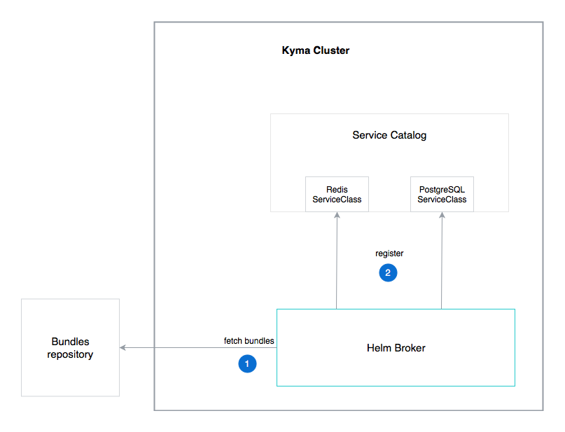

The Helm Broker workflow starts with the registration process, during which the Helm Broker fetches yBundles from the Kyma bundles directory, or from a remote HTTP server.

### Registration process

The registration process in the case of the Helm Broker consists of the following steps:
1. The Helm Broker fetches yBundles from the Kyma bundles directory, or from the remote HTTP server.
2. The Helm Broker registers yBundles as ServiceClasses in the Service Catalog.

### yBundles provisioning and binding

After the registration, the process of yBundle provisioning and binding takes place. It consists of the following steps:

1. Select a given bundle ServiceClass from the Service Catalog.
2. Provision this ServiceClass by creating its ServiceInstance in the given Environment.
3. Bind your ServiceInstance to the service or lambda. During the binding process, ServiceBinding and ServiceBindingUsage resources are created.
4. The service or lambda calls yBundle.

