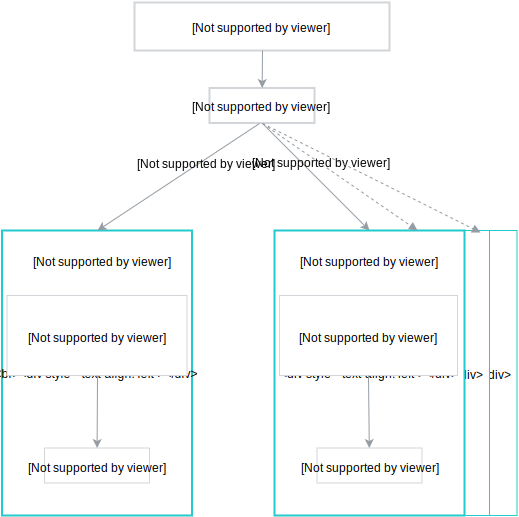

## Service description

The `gcp-broker-provider` service provides the following plan names and descriptions:

| Plan Name | Description |
|-----------|-------------|
| `Default` | Installs the Google Cloud Platform (GCP) Service Broker in a default configuration. |

## Provisioning

>**NOTE:** You can provision only one instance of the GCP Service Broker Provider in each Namespace.

To add GCP Broker Provider to your Namespace, you must prepare a service account and a 
JSON access key. 

Follow these steps to create a Kubernetes Secret which contains a JSON access key:
1. Open https://console.cloud.google.com/ and select your project.
2. On the left pane, go to **IAM & admin** and select **Service accounts**.
3. Click **Create service account**, name your account, and click **Create**.
4. Set the `Project Owner` role.
5. Click **Create key** and choose `JSON` as a key type.
6. Save the `JSON` file.
7. Create a Secret from the JSON file by running this command:
    ```
    kubectl create secret generic gcp-broker-data --from-file=sa-key={filename} --from-literal=project-name={gcp-project} --namespace {namespace}
    ```

8. Click **Done**.

>**NOTE:** You must create a Secret in every Namespace where you provision the GCP Broker Provider class.

The service account key is used to 
generate service account keys used by brokers installed in different Namespaces.
The generated service account key has a **roles/servicebroker.operator** role and is 
used during provisioning, deprovisioning, binding, and unbinding actions.



Provisioning and deprovisioning processes use the [GCP Broker Provider](https://github.com/kyma-project/kyma/tree/master/tools/gcp-broker-provider) tool.

The provisioning process flow looks as follows:
1. The user triggers the provisioning action.
2. The provisioning script checks if Secret exists in a given Namespace and downloads it.
3. The script configures gcloud CLI basing on values from the Secret.
4. The script uses the [sc](https://github.com/kyma-incubator/k8s-service-catalog) CLI to add the GCP Broker to the Kyma cluster.
5. The `sc` CLI creates a service account and access key on the Google Cloud Platform.
6. After the provisioning process, the post-install job is triggered.


In the Service Catalog view, click **Google Cloud Platform Service Broker Provider**.
Provisioning of this class adds GCP Service Broker classes to the Service Catalog in a given Namespace.

## Binding

Binding to this Service Class is disabled.

## Deprovisioning

The deprovisioning process flow looks as follows:
1. The user triggers the deprovisioning action.
2. The provisioning script checks if Secret exists in a given Namespace and downloads it. 
   If Secret does not exist, the `sc` CLI is executed with the **--skip-gcp-integration** parameter (step 6). 
3. The script configures gcloud CLI basing on values from the Secret.
4. The script uses [sc](https://github.com/kyma-incubator/k8s-service-catalog) CLI to remove the GCP Broker from the Kyma cluster.
5. `sc` CLI removes access keys from the Google Cloud Platform.


