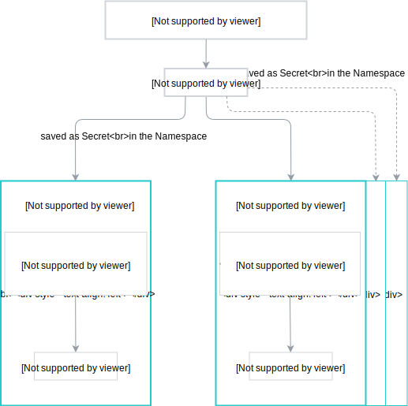

## Service description

The `gcp-broker-provider` service provides the following plan names and descriptions:

| Plan Name | Description |
|-----------|-------------|
| `Default` | Installs the Google Cloud Platform (GCP) Service Broker in a default configuration. |

## Provisioning

>**NOTE:** You can provision only one instance of the GCP Service Broker Provider in each Namespace.

To add GCP Broker Provider to your Namespace, you must prepare a service account and a 
JSON access key. 

Follow these steps to create a Kubernetes Secret which contains a JSON access key:
1. Open https://console.cloud.google.com/ and select your project.
2. On the left pane, go to **IAM & admin** and select **Service accounts**.
3. Click **Create service account**, name your account, and click **Create**.
4. Set the `Project Owner` role.
5. Click **Create key** and choose `JSON` as a key type.
6. Save the `JSON` file.
7. Create a Secret from the JSON file by running this command:

```
kubectl create secret generic gcp-broker-data --from-file=sa-key={filename} --from-literal=project-name=kyma-project --namespace {namespace}
```

>**NOTE:** You must create a Secret in every Namespace where you provision the GCP Broker Provider class.

In the Service Catalog view, click **Google Cloud Platform Service Broker Provider**.
Provisioning of this class adds GCP Service Broker classes to the Service Catalog in a given Namespace.

The service account key created by user is used to 
generate service account keys used by brokers installed in different Namespaces.
The generated service account key has a **roles/servicebroker.operator** role and is 
used during provisioning, deprovisioning, binding, and unbinding actions.



The provisioning process flow looks as follows:


1. The user triggers the provisioning action.
2. During the provisioning process new service account and access key are created in **Google Cloud Platform**
3. After the provisioning process, the post-install job is triggered.

## Binding

Binding to this Service Class is disabled.

## Deprovisioning

The deprovisioning process flow looks as follows:


1. The user triggers the deprovisioning action.
2. If the Secret is present, access keys are removed from the Google Cloud Platform.


