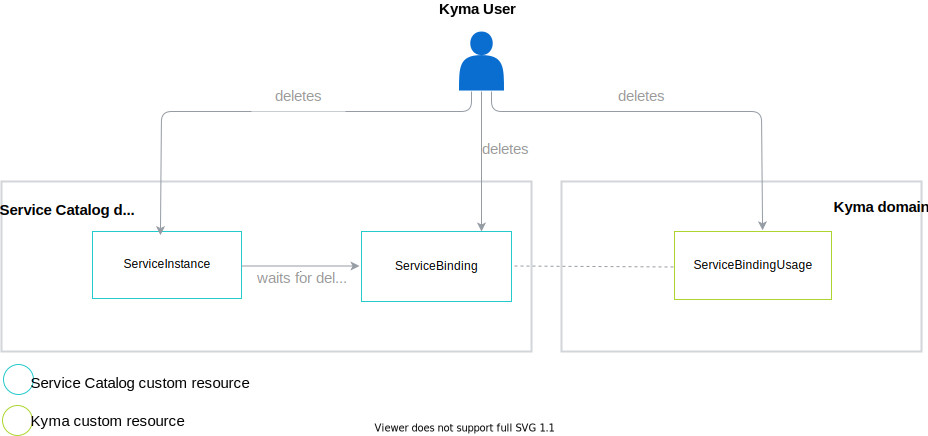
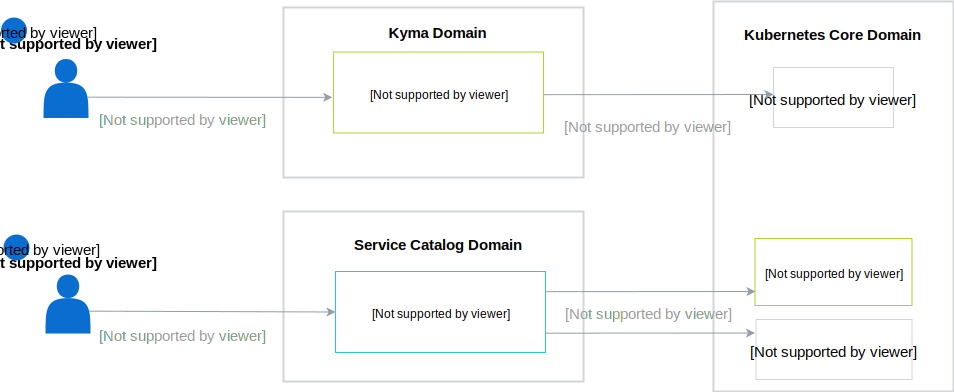

Unbinding and deprovisioning are processes reverse to provisioning and binding. The diagram shows an overview of interactions between all resources related to the processes of unbinding and deprovisioning a service:

## Unbind a service

You can unbind a service in two ways:
- Delete a ServiceBindingUsage. During this process, the Secret injection is deleted, but the Secret itself still exists in the Namespace.
- Delete a ServiceBinding. It deletes the Secret and triggers the deletion of all related ServiceBindingUsage custom resources.

## Deprovision a service

To deprovision a given service, delete the ServiceInstance custom resource. During this operation, a Service Broker deletes all custom resources created during the provisioning process. When the process is complete, the service becomes unavailable.

>**TIP:** Deleting a ServiceInstance deletes all related ServiceBinding and ServiceBindingUsage custom resources. If you want to deprovision a service completely, skip the unbinding process and simply delete the ServiceInstance.
