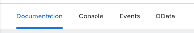
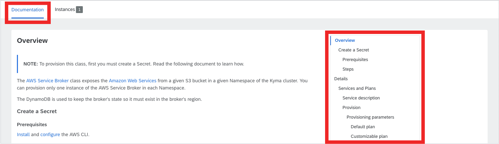
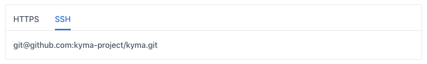
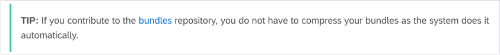

Documentation for Service Classes is rendered in both Service Catalog and Instances views. It includes the following specification types:

- Markdown
- [OpenAPI](https://www.openapis.org/)
- [AsyncAPI](https://www.asyncapi.com/)
- [OData](https://www.odata.org/)

This document explains how and where these specifications are rendered in the Console UI. It also describes the structure of the Markdown documents, their obligatory metadata, and optional features in the content body.

## Tabs

Depending on the type of the input files, the Console UI renders specifications under different tabs in Service Catalog and Instances views:

- Markdown under the **Documentation** tab.
- OpenAPI under the **Console** tab.
- AsyncAPI under the **Events** tab.
- OData under the **OData** tab.

See the tabs overview:



>**NOTE:** OpenAPI, OData, and AsyncAPI specifications rendered in the Console UI follow the [Fiori 3 Fundamentals](https://sap.github.io/fundamental/) styling standards.

## Markdown documents

DocsTopic and ClusterDocsTopic custom resources that orchestrate documentation in the Console UI support various documentation formats, including Markdown (`.md`) documents. Each `.md` file must consist of two parts: metadata and content. The following example illustrates the required structure:

```
---
metadata: {value or text string}
another_metadata: {value or text string}
---

{The content of your document in **Markdown**.}
```

### Metadata

Each Markdown document displayed in the Kyma Console requires metadata in a specific format called [front matter](https://forestry.io/docs/editing/front-matter/).

### Structure

When you create a Markdown document, define its `title` and `type`. Place the metadata at the top of your `.md` file, and separate it with three dashes.

```
---
title: {Document title}
type: {Document type}
---
```

- The `title` metadata defines the title of your document. If you want the title or its part to render inside quotation marks, place it between additional, single quotation marks or use a backslash (**/**) before the quoted word. See the following examples:

  ✅ `title: '"Transport is closing" error'`

  ✅ `title: "\"Transport is closing\" error"`

  ⛔️ `title: "Transport is closing" error`

- The `type` metadata groups single documents together. Multiple documents that use the same `type` generate a grouping. For example, if you have multiple tutorials, you can group them under a navigation node called **Tutorials**.

>**NOTE:** If there is only one document of a certain type, remove the `type` metadata, so that the document displays well in the UI.

### Display

In the Service Catalog and Instances views, which contain Service Classes documentation, Markdown documents display in the **Documentation** tab. The `title` and `type` metadata create the right-side navigation. A document with the **Overview** `title` always displays on top. If you don't provide `title` and `type`, these UIs display the file name as a fallback. The right-side document structure is based on the same logic as in the Documentation view. See the following example:

<div tabs>
  <details>
  <summary>
  Metadata source
  </summary>

```
//overview.md
---
title: Overview
---
```
```
//plan-details.md
---
title: Services and Plans
type: Details
---
```
  </details>
  <details>
  <summary>
  Service Catalog UI preview
  </summary>


  </details>
</div>

>**NOTE:** A document with the **Overview** `title` always displays as the first tab. Markdown files with `title` other than **Overview** appear in alphanumeric order.

### Content

Content is the body of your document. Write content in [Markdown](https://daringfireball.net/projects/markdown/syntax) which is a simplified markup language.

In Kyma, to make documentation more reader-friendly, some Markdown features are customized. See the following examples:

1. [Linking](https://github.com/kyma-project/community/blob/master/guidelines/content-guidelines/05-links.md) - link between documents in the same topic or in different topics using metadata.

    <div tabs>
      <details>
      <summary>
      Source
      </summary>

    Create a reference using the /{type-of-topic}/{id}#{type}-{title}-{header} pattern:
    ```
    [Kyma in a nutshell](/root/kyma/#overview-in-a-nutshell)
    ```
      </details>
      <details>
      <summary>
      Preview
      </summary>

      [Kyma in a nutshell](/root/kyma/#overview-kyma-in-a-nutshell)
      </details>
    </div>

2. [Documentation toggles](https://github.com/kyma-project/community/blob/master/guidelines/content-guidelines/03-documentation-toggle.md) - render several versions of a given section in one document or have several versions of one document.

    <div tabs>
      <details>
      <summary>
      Source
      </summary>

    ```
    <div tabs>
      <details>
      <summary>
      HTTPS
      </summary>

      https://github.com/kyma-project/kyma.git
      </details>
      <details>
      <summary>
      SSH
      </summary>

      git@github.com:kyma-project/kyma.git
      </details>
    </div>
    ```
      </details>
      <details>
      <summary>
      Preview
      </summary>

    
      </details>
    </div>

3. [Panels](https://github.com/kyma-project/community/blob/master/guidelines/content-guidelines/04-formatting.md#panels) - use colorful containers that call out important or additional information within a topic.

    <div tabs>
      <details>
      <summary>
      Source
      </summary>

    ```
    >**TIP:** If you contribute to the [addons](https://github.com/kyma-project/addons/tree/master/addons) repository, you do not have to compress your addons as the system does it automatically.
    ```
      </details>
      <details>
      <summary>
      Preview
      </summary>

    
      </details>
    </div>

Read the [Content Guidelines](https://github.com/kyma-project/community/tree/master/guidelines/content-guidelines) to learn more about the customized Markdown features and other rules of writing content in Kyma.

>**CAUTION:** Markdown customized in a different way than in Kyma may not render properly in the Console UI.
