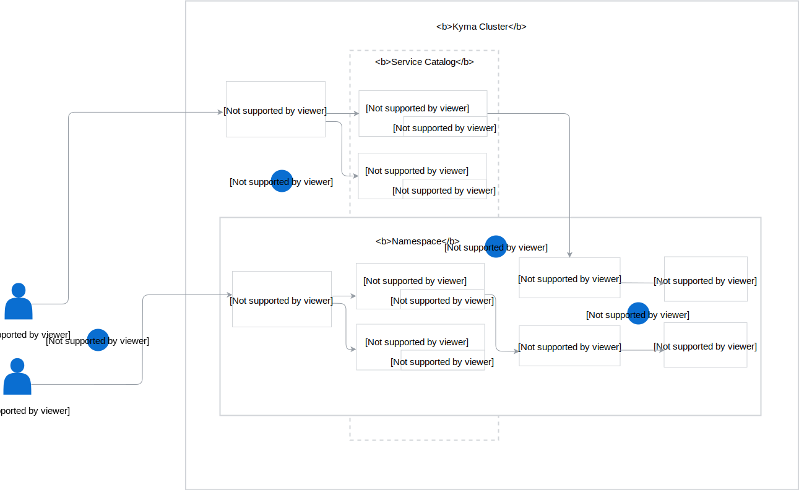

The diagram and steps describe the Service Catalog workflow and the roles of specific cluster and Namespace-wide resources in this process:

1. The Kyma installation results in the registration of the default Service Brokers in the Kyma cluster. The Kyma administrator can manually register other ClusterServiceBrokers in the Kyma cluster. The Kyma user can also register a Service Broker in a given Namespace.

2. Inside the cluster, each ClusterServiceBroker exposes services that are ClusterServiceClasses in their different variations called ClusterServicePlans. Similarly, the ServiceBroker registered in a given Namespace exposes ServiceClasses and ServicePlans only in this specific Namespace.

3. In the Console UI or CLI, the Kyma user lists all exposed cluster-wide and Namespace-specific services and requests to create instances of those services in the Namespace.

4. The Kyma user creates bindings to the ServiceInstances to allow the given applications to access the provisioned services.
