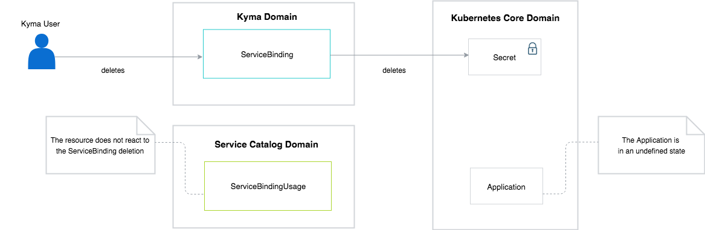

As mentioned in the **Provisioning and binding** document, it is crucial that you follow the order in which you delete the ServiceBindingUsage and the ServiceBinding resources from the Service Catalog during the unbinding operation. According to the deletion process, you must delete the ServiceBindingUsage first and the ServiceBinding afterward, due to dependencies between the two resources.

This diagram shows the consequences of deleting the ServiceBinding for the existing ServiceBindingUsage:

When you delete a ServiceBinding, the Service Catalog does not populate this information to the ServiceBindingUsage. It is possible that after you delete the ServiceBinding, the Service Catalog does not clearly show that the ServiceBindingUsage no longer works properly.

After you remove the resources in an incorrect order, the application which consumes the resources that are linked using ServiceBindingUsage can be in one of the following states:

-  If you do not restart the application, it still works correctly if the Service Broker does not discredit the injected information.
-  If you do not restart the application, it can stop working correctly if the Service Broker discredits the injected information.
- If you restart the application, it does not start again because of the missing Secrets.
